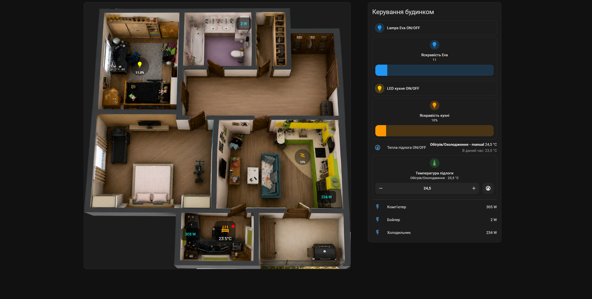

# Home Assistant 3D Apartment Dashboard

AI-generated 3D apartment dashboard for Home Assistant with Google Assistant SDK integration, YAML configuration, dimmers, sensors and interactive controls.



---

# Features

- 🏠 3D Apartment Dashboard
- 🤖 AI-generated top-view rooms
- 💡 Light & Dimmer controls
- 🌡️ Temperature sensors
- ⚡ Power monitoring
- 🔥 Floor heating control
- 🧠 Google Assistant SDK integration
- 🚫 Control devices WITHOUT "OK Google"
- 🎨 YAML customization
- 📱 Fully interactive Home Assistant UI

---

# Files

| File | Description |
|------|-------------|
| `apartment.yaml` | 3D apartment picture-elements dashboard |
| `panel.yaml` | Right-side control panel dashboard |
| `3D Apartment Dashboard.png` | Main apartment image |
| `clipboard_image_*.png` | Additional preview/screenshot |

---

# Requirements

Before using this dashboard you should install/configure:

- Home Assistant
- HACS
- Mushroom Cards
- Google Assistant SDK
- Google OAuth credentials
- Picture Elements Card

---

# Installation

## 1. Upload PNG image

Upload:

```text
3D Apartment Dashboard.png
```

to:

```text
/config/www/
```

Then image will be available as:

```text
/local/3D Apartment Dashboard.png
```

---

## 2. Add apartment dashboard

Copy YAML from:

```text
apartment.yaml
```

This is the main 3D apartment picture-elements card.

---

## 3. Add control panel

Copy YAML from:

```text
panel.yaml
```

This is the right-side control panel with:
- dimmers
- sliders
- switches
- temperatures
- power monitoring
- controls

---

## 4. Change entities

Replace entities with your own.

Example:

```yaml
light.dimmer_kukhnia
sensor.kompiuter_power
climate.floor_heating
input_number.lamps_eva_brightness
```

Tutorial video:
([Add your YouTube link here](https://youtu.be/IA9cHZjQhpw))

Author

Anton Babenko

GitHub:
https://github.com/bobantonbob/home-assistant-stack
