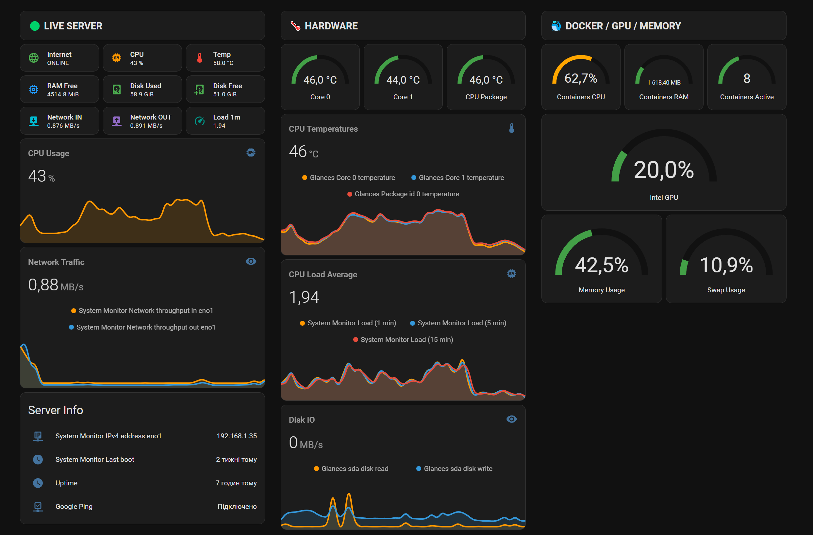

# Glances + Docker + Home Assistant Server Monitoring

<p align="center">
  
</p>

🚀 Powerful Server Monitoring Dashboard for Home Assistant using:

- Glances
- Docker
- Portainer
- YAML
- HACS

---

# 🔥 Features

✅ CPU Monitoring  
✅ RAM / SWAP Monitoring  
✅ Docker Containers Monitoring  
✅ Intel GPU Monitoring  
✅ CPU Temperatures  
✅ Disk Usage / IO  
✅ Network Traffic  
✅ Uptime Monitoring  
✅ Telegram Alerts  
✅ Beautiful NOC Style Dashboard

---

# 📂 Files

| File | Description |
|------|-------------|
| `Glances_Dashboard.yaml` | Ready Home Assistant Dashboard |
| `Glances_Dashboard.png` | Dashboard Preview |
| `README.md` | Installation Guide |

---

# 🐳 Install Glances via Docker / Portainer

## 1️⃣ Open Portainer

Go to:

```text
Portainer → Stacks
2️⃣ Create New Stack

Stack Name:

glances
3️⃣ Paste Docker Compose
services:
  glances:
    image: nicolargo/glances:latest-full
    container_name: glances
    restart: unless-stopped
    pid: host
    network_mode: host

    environment:
      - GLANCES_OPT=-w

    volumes:
      - /var/run/docker.sock:/var/run/docker.sock:ro
4️⃣ Deploy Stack

Click:

Deploy Stack

Container will start in a few seconds 🚀

🌐 Open Glances Web Interface

Open in browser:

http://YOUR_SERVER_IP:61208

Example:

http://192.168.1.35:61208
🏠 Home Assistant Integration

Go to:

Settings → Devices & Services → Add Integration

Search:

Glances
⚙️ Integration Settings
Host: localhost
Port: 61208

Leave username and password empty if not configured.

📊 New Sensors

After installation Home Assistant will create sensors automatically.

Examples:

sensor.containers_cpu_usage
sensor.containers_memory_used
sensor.containers_active

sensor.glances_core_0_temperature
sensor.glances_core_1_temperature
sensor.glances_package_id_0_temperature

sensor.glances_memory_usage
sensor.glances_swap_usage

sensor.glances_sda_disk_read
sensor.glances_sda_disk_write
🔥 What Glances Can Monitor

✅ CPU Usage
✅ CPU Temperatures
✅ RAM Usage
✅ SWAP Usage
✅ Docker Containers
✅ Container CPU Usage
✅ Container RAM Usage
✅ Disk IO
✅ Network Traffic
✅ GPU Usage
✅ System Load Average
✅ Uptime

🤖 YAML Dashboard

Dashboard is fully YAML based.

Advantages:

easy copy-paste
faster editing
reusable sections
simple customization
perfect with ChatGPT generated YAML
📲 Automation Ideas
Disk Full Alert
condition:
  - condition: numeric_state
    entity_id: sensor.disk_usage
    above: 90
High CPU Alert
condition:
  - condition: numeric_state
    entity_id: sensor.cpu_usage
    above: 90
    for:
      hours: 2
🔥 Real Example

While using Frigate during heavy rain,
Frigate started detecting every rain drop as a person 😄

CPU usage instantly jumped over 100%.

Thanks to Glances Dashboard the issue was detected immediately and fixed quickly.

📂 GitHub Repository
https://github.com/bobantonbob/home-assistant-stack
