# Home Assistant 3D Dashboard Course

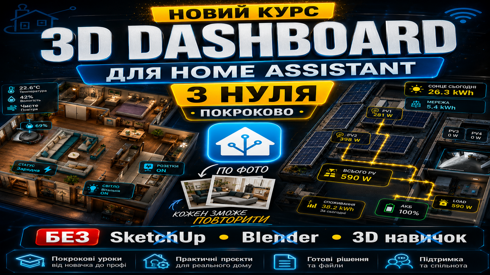

Курс по створенню красивого **3D Dashboard в Home Assistant**.

У цьому курсі ми покроково перетворюємо звичайну картинку квартири, будинку або даху на повноцінний живий дашборд з кнопками, сенсорами, підсвітками, індикаціями, камерою, електромобілем, сонячною генерацією, прогнозом Solcast та адаптацією під смартфони.

---

## Готовий приклад головного дашборду

Ось так виглядає загальний 3D Dashboard, який ми поступово збираємо в цьому курсі:


---

## YouTube playlist

Всі заняття курсу на YouTube:

[▶ Перейти до плейлиста Home Assistant 3D Dashboard Course](https://www.youtube.com/playlist?list=PLWo_AYhwCKTYjH7dXVjOddqfM8Hl3zIvo)

---

## Головна ідея курсу

Ми беремо 3D-зображення квартири, будинку або даху і поступово додаємо на нього реальні елементи Home Assistant:

- датчики потужності;
- кнопки керування;
- світло;
- LED-стрічки;
- теплу підлогу;
- live camera;
- індикацію батареї авто;
- кнопку зарядки авто;
- блок навантаження;
- сонячну генерацію;
- PV1 / PV2 віджети;
- анімацію стрінгів;
- анімацію мікроінверторів;
- прогноз генерації Solcast;
- адаптацію під телефон, планшет або смарт-панель.

У результаті отримуємо не просто красиву картинку, а нормальний інтерактивний дашборд для керування будинком.

---

## Структура занять

> У кожному занятті є два варіанти: перейти в папку з кодом на GitHub або відкрити відеоурок на YouTube.

---

### Заняття 1 — Базовий 3D Floorplan

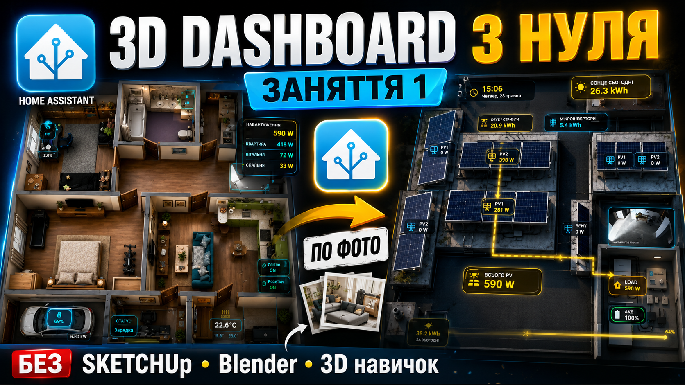

Створюємо основу майбутнього дашборду: додаємо 3D-картинку квартири в Home Assistant і робимо перший `picture-elements` dashboard.

[📁 Перейти на GitHub](./lesson-01-basic-floorplan)  
[▶ Дивитися відео](https://youtu.be/-yM2K42HF0k)

---

### Заняття 2 — Power Sensor Card + LED Strip Button

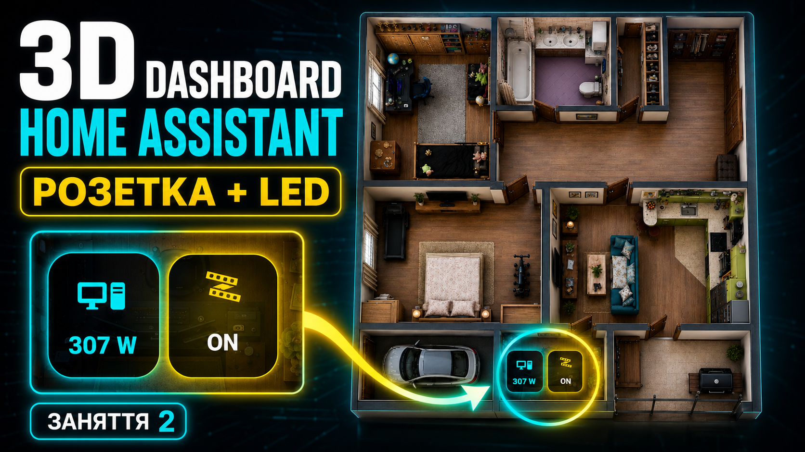

Додаємо перші живі елементи: сенсор потужності та кнопку LED-стрічки прямо на 3D Dashboard.

[📁 Перейти на GitHub](./lesson-02-power-sensor-card-led-strip-button)  
[▶ Дивитися відео](https://youtu.be/VM2D5Und2K0)

---

### Заняття 3 — LED ON/OFF + Light Dimmer Button

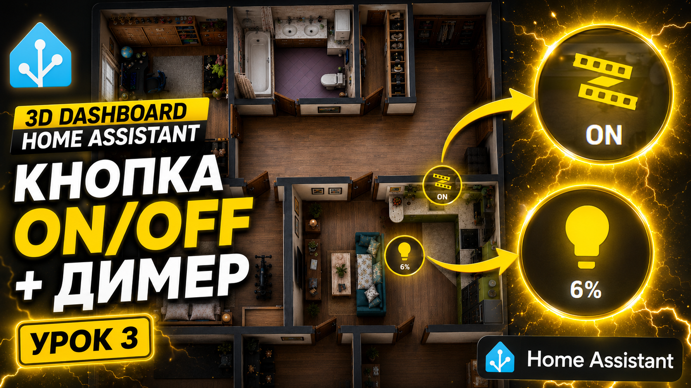

Покращуємо керування світлом: робимо кнопку ON/OFF, додаємо димер і відкриття `more-info`.

[📁 Перейти на GitHub](./lesson-03_led_on_off_light_dimmer_button)  
[▶ Дивитися відео](https://youtu.be/d14denK9YnE)

---

### Заняття 4 — Active TV Button + Live Camera

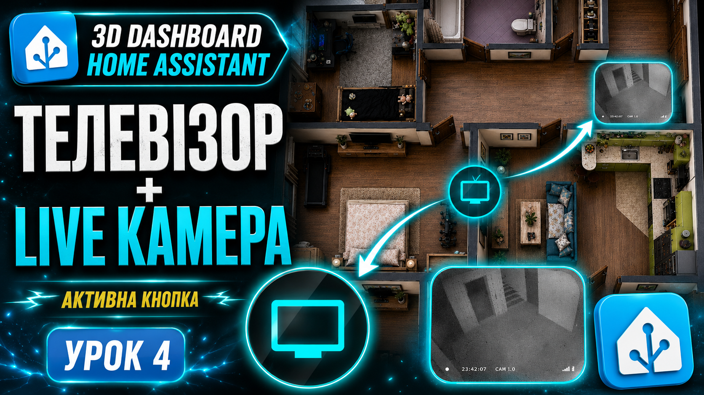

Додаємо активну кнопку телевізора та live camera на 3D Dashboard.

[📁 Перейти на GitHub](./lesson-04-active-tv-button-live-camera)  
[▶ Дивитися відео](https://youtu.be/iCmSAX7AjwA)

---

### Заняття 5 — Floor Heating Button with Heating Indicator

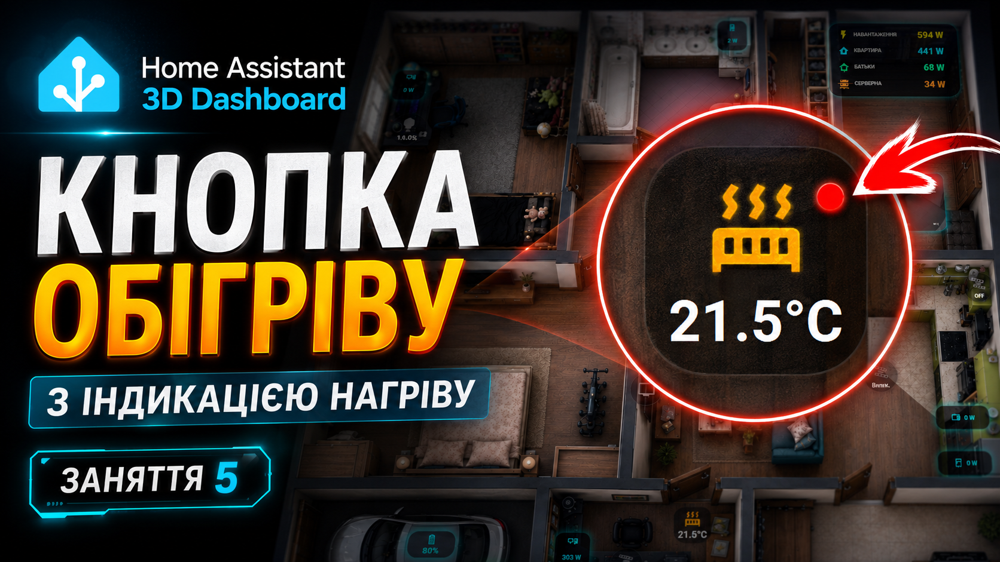

Додаємо теплу підлогу, кнопку керування та індикацію нагріву на 3D-карті.

[📁 Перейти на GitHub](./lesson-05-floor-heating-button-with-heating-indicator)  
[▶ Дивитися відео](https://youtu.be/q-2emY63A_Y)

---

### Заняття 6 — Car Battery Dashboard

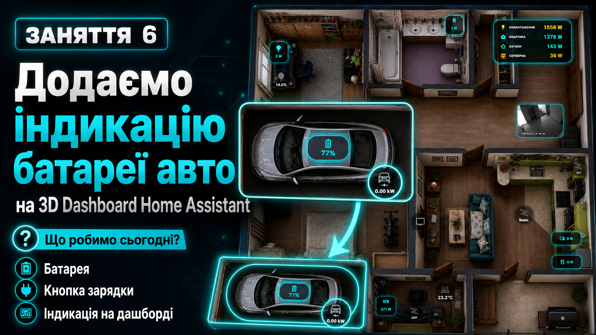

Додаємо індикацію електромобіля: заряд батареї, кнопку зарядки, потужність зарядки та адаптивний розмір через `clamp()`.

[📁 Перейти на GitHub](./lesson6_car_battery_dashboard)  
[▶ Дивитися відео](https://youtu.be/KcO1pEHh3x4)

---

### Заняття 7 — Load Power Block + Adaptive Smartphone Dashboard

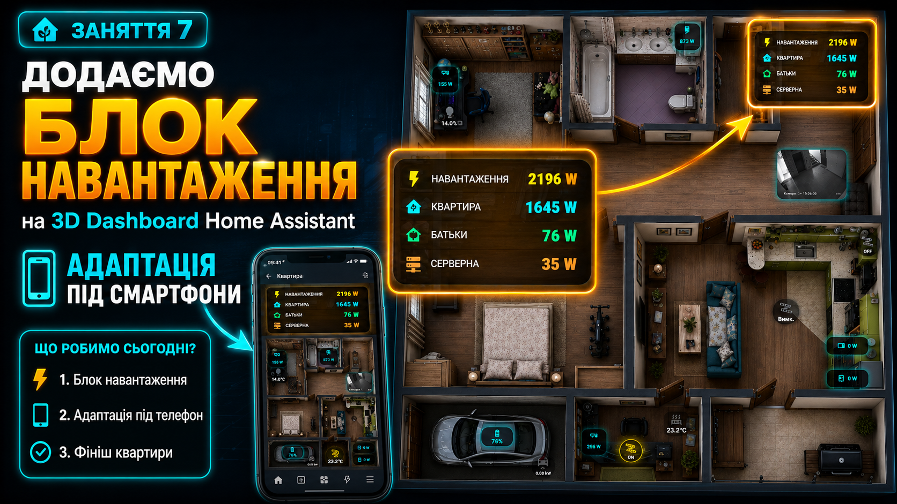

Додаємо блок загального навантаження, окремі рядки споживання та адаптацію дашборду під смартфони.

[📁 Перейти на GitHub](./lesson-07-load-power-adaptive-smartphone)  
[▶ Дивитися відео](https://youtu.be/L1NtV5OnMRc)

---

### Заняття 8 — Roof Solar Dashboard

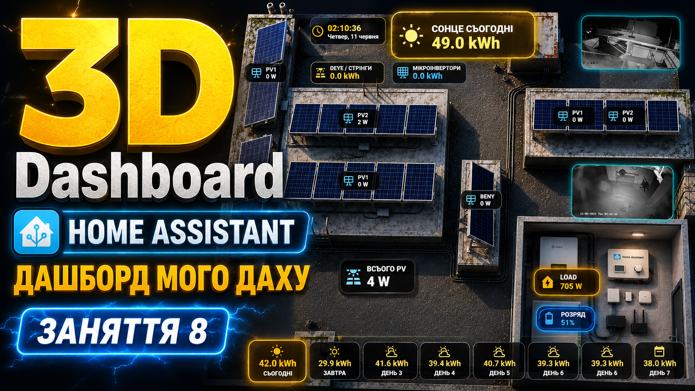

Переходимо до даху: готуємо 3D-зображення з сонячними панелями та починаємо створювати даховий solar dashboard.

[📁 Перейти на GitHub](./lesson-08-roof-solar-dashboard)  
[▶ Дивитися відео](https://youtu.be/5cNPHwUvqUo)

---

### Заняття 9 — Clock + Total PV Widgets

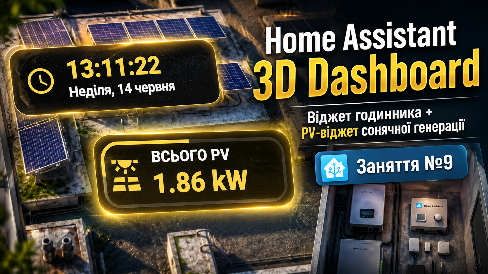

Додаємо віджет годинника та загальний віджет сонячної генерації на даховий дашборд.

[📁 Перейти на GitHub](./lesson-09-clock-total-pv-widgets)  
[▶ Дивитися відео](https://youtu.be/1tI1tuKkCgQ)

---

### Заняття 10 — PV1 + Live Camera Widget


Додаємо окремий PV1-віджет і live camera widget, щоб на дашборді було видно і дані, і реальну картинку з камери.

[📁 Перейти на GitHub](./lesson-10-pv1-live-camera-widget)  
[▶ Дивитися відео](https://youtu.be/UjfNVzE2q70)

---

### Заняття 11 — Microinverter + Load + Battery Widgets

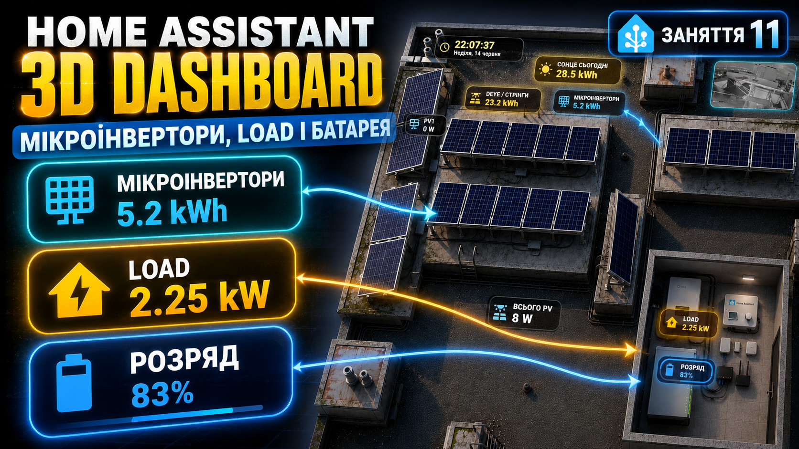

Додаємо віджети мікроінверторів, навантаження та акумулятора, щоб бачити основні енергетичні дані прямо на 3D Dashboard.

[📁 Перейти на GitHub](./lesson-11-microinverter-load-battery-widgets)  
[▶ Дивитися відео](https://youtu.be/6Zw_zExtnrY)

---

### Заняття 12 — Sun Progress Template and Card

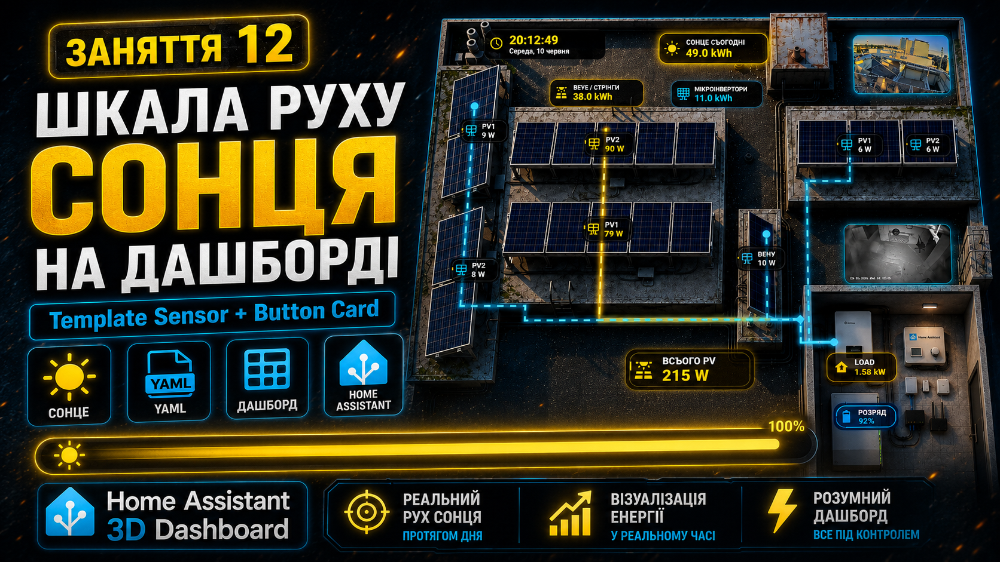

Створюємо сенсор прогресу сонячного дня та картку, яка показує, де зараз сонце відносно дня.

[📁 Перейти на GitHub](./lesson-12-sun-progress-template-and-card)  
[▶ Дивитися відео](https://youtu.be/aLAcCEQ9Dn4)

---

### Заняття 13 — Solcast 7-Day Forecast Cards

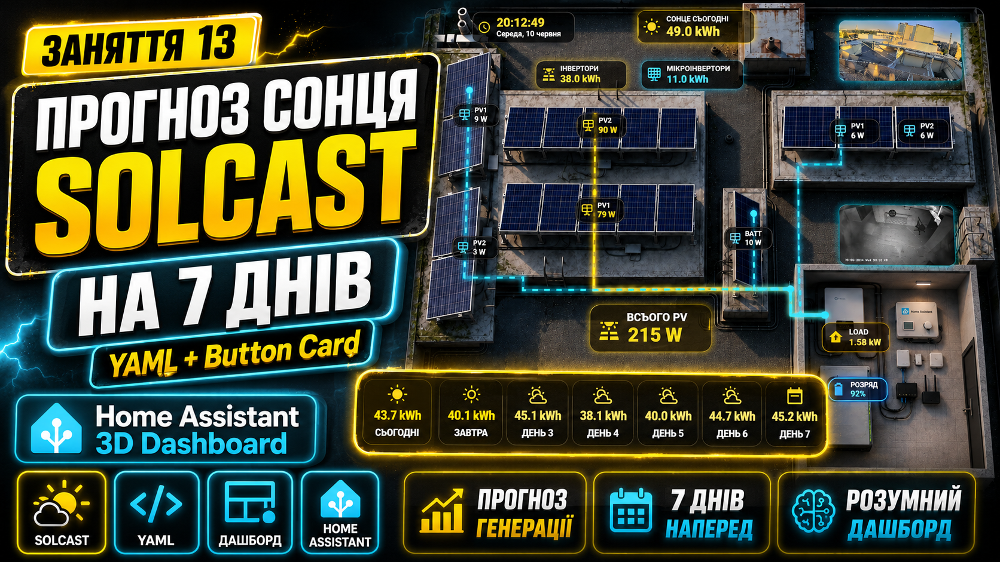

Додаємо прогноз генерації Solcast на 7 днів і виводимо його красивими картками на дашборд.

[📁 Перейти на GitHub](./lesson-13-solcast-7-day-forecast-cards)  
[▶ Дивитися відео](https://youtu.be/hxcBTP9K1nU)

---

### Заняття 14 — Roof Strings & Microinverters Animation

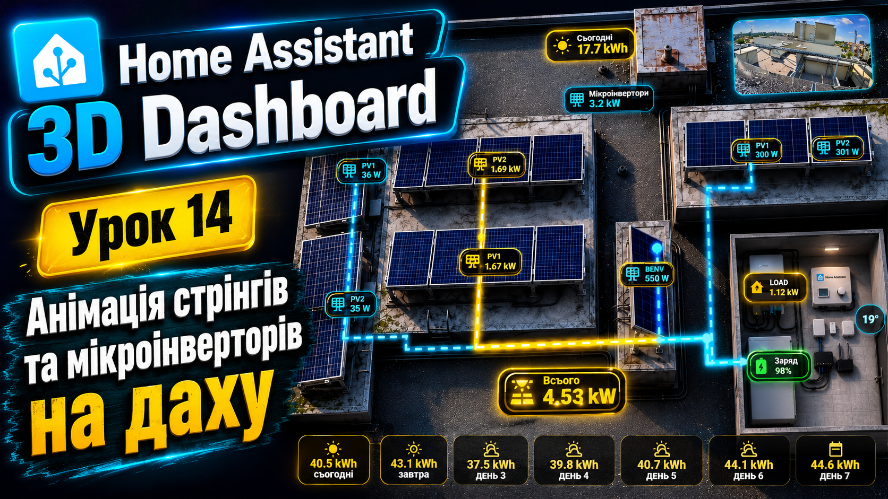

Додаємо анімацію стрінгів і мікроінверторів на даху. Через YAML-код показуємо SVG-потоки тільки тоді, коли є день, а мікроінвертори додатково показуються тільки коли вони увімкнені.

[📁 Перейти на GitHub](./lesson-14-roof-strings-microinverters-animation)  
[▶ Дивитися відео](https://youtu.be/GHcJWlTnLrk)

---


### Заняття 15 — Air conditioner card in Home Assistant

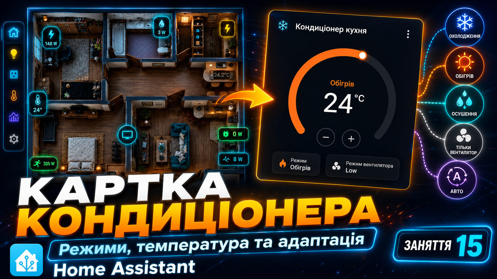

Додаємо анімацію стрінгів і мікроінверторів на даху. Через YAML-код показуємо SVG-потоки тільки тоді, коли є день, а мікроінвертори додатково показуються тільки коли вони увімкнені.

[📁 Перейти на GitHub](./lesson-15-air-conditioner-climate-card)  
[▶ Дивитися відео](https://youtu.be/dDJip0TmadI)

---

## Поточна структура репозиторію

```text
home-assistant-3d-dashboard-course/
├── preview3D/
│   ├── 3D_Dashboard_0.png
│   ├── 3D_Dashboard_1.png
│   ├── 3D_Dashboard_2.png
│   ├── 3D_Dashboard_3.png
│   ├── 3D_Dashboard_4.png
│   ├── 3D_Dashboard_5.png
│   ├── 3D_Dashboard_6.png
│   ├── 3D_Dashboard_7.png
│   ├── 3D_Dashboard_8.png
│   ├── 3D_Dashboard_9.png
│   ├── 3D_Dashboard_10.png
│   ├── 3D_Dashboard_11.png
│   ├── 3D_Dashboard_12.png
│   ├── 3D_Dashboard_13.png
│   └── 3D_Dashboard_14.png
│   └── 3D_Dashboard_15.png
├── lesson-01-basic-floorplan/
├── lesson-02-power-sensor-card-led-strip-button/
├── lesson-03_led_on_off_light_dimmer_button/
├── lesson-04-active-tv-button-live-camera/
├── lesson-05-floor-heating-button-with-heating-indicator/
├── lesson6_car_battery_dashboard/
├── lesson-07-load-power-adaptive-smartphone/
├── lesson-08-roof-solar-dashboard/
├── lesson-09-clock-total-pv-widgets/
├── lesson-10-pv1-live-camera-widget/
├── lesson-11-microinverter-load-battery-widgets/
├── lesson-12-sun-progress-template-and-card/
├── lesson-13-solcast-7-day-forecast-cards/
├── lesson-14-roof-strings-microinverters-animation/
├── lesson-15-air-conditioner-climate-card/
├── README.md
└── dashboard_full.png
```

---

## Що потрібно для повторення

Для роботи з цими прикладами бажано мати:

- Home Assistant;
- HACS;
- `custom:button-card`;
- `picture-elements`;
- свої сенсори та сутності;
- 3D-картинку квартири, будинку або даху;
- базове розуміння YAML.

---

## Важливо

У моїх прикладах використовуються мої назви сутностей, наприклад:

```yaml
sensor.deye_load_power
sensor.ups_power
sensor.anma_battery_level
switch.tesla_switch
sensor.sun_day_progress
switch.sonoff4_ha_sonoff_1000066f8f_1
```

У вас ці назви будуть іншими.

Перед використанням коду відкрийте:

```text
Home Assistant → Developer Tools → States
```

і знайдіть свої сутності. Після цього замініть мої `sensor...`, `switch...`, `light...`, `camera...` на свої.

---

## Як користуватися курсом

1. Відкриваєте потрібне заняття.
2. Дивитесь preview-картинку.
3. Переходите в папку заняття на GitHub.
4. Читаєте `README.md` всередині заняття.
5. Дивитесь відеоурок на YouTube.
6. Відкриваєте YAML-файли.
7. Замінюєте сутності на свої.
8. Вставляєте код у свій Dashboard.
9. Рухаєте елементи через `top` та `left`.
10. Перевіряєте вигляд на комп’ютері та телефоні.

---

## Основна фішка

Мета курсу — показати, що Home Assistant Dashboard може бути не тільки стандартним набором карток.

Його можна зробити у вигляді повноцінної 3D-карти квартири, будинку або даху, де кожен елемент має своє місце, свою логіку, свою індикацію і реально допомагає керувати системою.

---

## Автор

Курс створено для YouTube / GitHub серії по Home Assistant 3D Dashboard.

GitHub:  
https://github.com/bobantonbob/home-assistant-stack

YouTube playlist:  
https://www.youtube.com/playlist?list=PLWo_AYhwCKTYjH7dXVjOddqfM8Hl3zIvo
