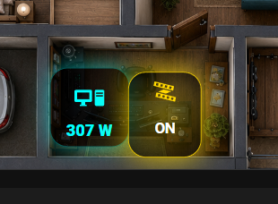

# Lesson 02 — Power Sensor Card + LED Strip Button

## 3D Dashboard Home Assistant | Заняття 2

У цьому занятті ми продовжуємо створювати власний 3D Dashboard у Home Assistant.

Після того як у першому занятті ми підготували 3D-зображення квартири та використали його як фон для `picture-elements`, у другому занятті ми додаємо перші інтерактивні елементи на план.

У цьому занятті ми додали на 3D Dashboard дві кнопки:

- кнопку потужності розетки біля комп’ютера;
- кнопку вмикання та вимикання LED-стрічки.

Ось так це виглядає на дашборді:



## Відео уроку

YouTube:
https://youtu.be/VM2D5Und2K0

```text
Додайте сюди посилання на відео заняття 2
```

## Що ми зробили в цьому занятті

У цьому уроці ми:

- відкрили дашборд Home Assistant через UI;
- перейшли в режим редагування дашборду;
- відкрили редактор коду для картки `picture-elements`;
- додали картку сенсора потужності для розетки комп’ютера;
- додали кнопку для вмикання та вимикання LED-стрічки;
- налаштували іконки через `mdi:`;
- налаштували відображення значення у ватах;
- налаштували статус `ON` / `OFF`;
- змінили кольори, розмір, фон, рамку та підсвітку;
- розмістили кнопки на 3D-плані за допомогою `top` і `left`;
- розібрали, за що відповідають основні блоки YAML-коду.

## Файли в цьому занятті

У цій папці знаходяться файли:

```text
lesson-02-power-sensor-card-led-strip-button/
│
├── power-sensor-card.yaml
├── led-strip-button.yaml
├── power-sensor-card-led-strip-button.png
└── README.md
```

### `power-sensor-card.yaml`

Файл з кодом кнопки/картки для відображення потужності розетки.

Цей блок показує поточне споживання у ватах, наприклад:

```text
307 W
```

Його можна використовувати для:

- комп’ютера;
- сервера;
- бойлера;
- холодильника;
- зарядної станції;
- будь-якої розетки з вимірюванням потужності.

### `led-strip-button.yaml`

Файл з кодом кнопки для LED-стрічки.

Цей блок дозволяє:

- вмикати LED-стрічку;
- вимикати LED-стрічку;
- показувати статус `ON` або `OFF`;
- змінювати вигляд кнопки залежно від стану.

### `power-sensor-card-led-strip-button.png`

Зображення з прикладом того, як ці дві кнопки виглядають на 3D Dashboard.

## Що потрібно зробити у себе

### 1. Відкрити дашборд Home Assistant

Перейдіть у свій дашборд Home Assistant, де вже використовується 3D-зображення квартири або будинку.

### 2. Увімкнути редагування

Натисніть:

```text
Edit dashboard / Редагувати панель
```

Після цього відкрийте картку з вашим 3D-планом.

### 3. Відкрити Code Editor

Для `picture-elements` зручно працювати саме через редактор коду.

Потрібно знайти блок:

```yaml
elements:
```

І вставити туди код потрібної кнопки.

## Приклад основи picture-elements

```yaml
type: picture-elements
image: /local/home11.png
aspect_ratio: 1/1
elements:
  # Тут будуть наші кнопки, сенсори та інші елементи
```

## Найголовніші параметри

| Параметр | За що відповідає |
|---|---|
| `type: custom:button-card` | Тип елемента. У цьому занятті ми використовуємо кастомну кнопку |
| `entity:` | Сутність Home Assistant, з якої береться стан або значення |
| `icon:` | Іконка, яка буде показуватись на кнопці |
| `show_name:` | Показувати або не показувати назву |
| `show_state:` | Показувати або не показувати стан |
| `tap_action:` | Дія при натисканні на кнопку |
| `hold_action:` | Дія при довгому натисканні |
| `state_display:` | Формат відображення стану або значення |
| `styles:` | Зовнішній вигляд кнопки |
| `styles.card:` | Фон, розмір, рамка, тінь, округлення |
| `styles.icon:` | Колір і розмір іконки |
| `styles.state:` | Колір, розмір і стиль тексту |
| `style:` | Позиція елемента на зображенні |
| `top:` | Рухає елемент вище або нижче |
| `left:` | Рухає елемент лівіше або правіше |
| `z-index:` | Визначає, який елемент буде поверх інших |

## Де брати entity

`entity` — це реальна сутність вашого пристрою в Home Assistant.

Наприклад:

```yaml
entity: sensor.smart_plug_power_2
```

або:

```yaml
entity: switch.wifi_breaker_t_2_switch_1
```

У вашому Home Assistant назви сутностей можуть бути іншими.

Щоб знайти потрібну сутність:

1. Відкрийте Home Assistant.
2. Перейдіть у потрібний пристрій або інтеграцію.
3. Знайдіть його `Entity ID`.
4. Скопіюйте його.
5. Вставте у код замість прикладу.

## Приклад сутності для сенсора потужності

```yaml
entity: sensor.smart_plug_power_2
```

Ця сутність показує поточну потужність розетки.

Якщо у вас інша розетка, замініть тільки цей рядок на свою сутність.

## Приклад сутності для LED-стрічки

```yaml
entity: switch.wifi_breaker_t_2_switch_1
```

Ця сутність відповідає за вмикання та вимикання LED-стрічки.

Якщо у вас інший вимикач, замініть тільки цей рядок на свою сутність.

## Де брати іконки

Іконки в Home Assistant використовують формат `mdi:`.

Наприклад:

```yaml
icon: mdi:desktop-tower-monitor
```

або:

```yaml
icon: mdi:led-strip-variant
```

Для кнопок можна використовувати різні іконки:

```yaml
mdi:desktop-tower-monitor
mdi:desktop-classic
mdi:monitor
mdi:power-plug
mdi:led-strip-variant
mdi:lightbulb
mdi:lightning-bolt
mdi:chip
```

## Як рухати кнопку по плану

Позиція елемента задається в блоці:

```yaml
style:
  top: 86%
  left: 43%
```

`top` відповідає за рух вгору або вниз.

`left` відповідає за рух вліво або вправо.

Наприклад, якщо потрібно змістити кнопку нижче:

```yaml
top: 88%
```

Якщо потрібно змістити кнопку правіше:

```yaml
left: 45%
```

## Як змінювати зовнішній вигляд

Уся стилізація знаходиться в блоці:

```yaml
styles:
```

Тут можна змінювати:

- фон;
- колір;
- розмір;
- рамку;
- округлення;
- тінь;
- світіння;
- розмір іконки;
- розмір тексту.

Наприклад:

```yaml
styles:
  card:
    - background: rgba(0,0,0,0.60)
    - border-radius: 12px
    - width: 54px
    - height: 54px
    - box-shadow: 0 0 14px rgba(0,255,255,0.55)
```

## Важливий момент

У стандартному UI Home Assistant не завжди можна просто вибрати зі списку готовий дизайн, світіння, рамку або кастомну поведінку кнопки.

Для простих карток частину параметрів можна налаштувати через інтерфейс.

Але якщо ми хочемо робити 3D Dashboard з красивими кнопками, підсвіткою, стилями та точним розміщенням на плані, то найзручніше працювати через Code Editor всередині UI.

Тобто ми все одно працюємо через інтерфейс Home Assistant, але складні елементи налаштовуємо кодом.

## Можна використовувати нейромережі

Якщо ви не програміст — це не проблема.

Ви можете взяти готовий код з цього заняття, вставити його в будь-яку нейромережу і написати, що саме хочете змінити.

Наприклад:

```text
Зроби цю кнопку меншою, зміни колір підсвітки на синій і додай іншу іконку.
```

Або:

```text
Перероби цю кнопку в стилі cyberpunk, щоб при включенні вона світилась жовтим.
```

Головне — правильно вказати свою `entity`, а дизайн можна поступово змінювати методом проб і помилок.

## Що ми отримали в результаті

Після цього заняття на 3D Dashboard з’явилися дві готові кнопки:

- кнопка потужності розетки;
- кнопка вмикання та вимикання LED-стрічки.

Це перші інтерактивні елементи нашого майбутнього 3D Dashboard.

## Наступний крок

У наступних заняттях можна додавати:

- інші розетки;
- світло в інших кімнатах;
- сенсори температури;
- камери;
- охорону;
- статус інвертора;
- батарею;
- енергоспоживання квартири;
- автоматизації.

## Автор

ANMA Electric / Home Assistant 3D Dashboard Course
