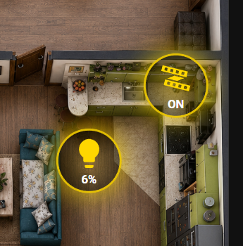

# Lesson 03 — LED ON/OFF Button + Light Dimmer Button for Home Assistant 3D Dashboard



## 📌 Назва заняття

**3D Dashboard Home Assistant ⚡ Кнопка ON/OFF + димер на плані кімнати | Заняття 3**

У цьому занятті ми продовжуємо створювати власний **3D Dashboard для Home Assistant**.

Це повний урок, у якому ми спочатку створюємо просту кнопку для керування LED-підсвіткою, а потім на її основі робимо кнопку-димер з відображенням яскравості у відсотках.

---

## 🖼️ Що робимо в цьому уроці


У цьому уроці ми додаємо на 3D-план кімнати два інтерактивні елементи:

1. **Кнопку ON/OFF** для звичайного вмикання та вимикання LED-підсвітки.
2. **Кнопку-димер** для світла, яка показує рівень яскравості у відсотках.

Кнопки розміщуються прямо поверх зображення кімнати або квартири, тому дашборд виглядає не як стандартна таблиця Home Assistant, а як інтерактивний 3D-план.

---

## ✅ Результат

Після цього уроку ми отримуємо:

- круглу кнопку на плані кімнати;
- керування пристроєм через коротке натискання;
- відкриття детальної інформації через довге натискання;
- відображення стану `ON / OFF`;
- жовте світіння кнопки, коли пристрій увімкнений;
- переробку кнопки під `light`-сутність;
- відображення яскравості димера у відсотках;
- зміну сили світіння залежно від яскравості.

---

## 📁 Структура файлів

У цій папці знаходяться файли для заняття:

```text
lesson-03_led_on_off_light_dimmer_button/
├── README.md
├── 01_led_on_off_button.yaml
├── 02_light_dimmer_button.yaml
├── dashboard_preview.png
├── home11.png
└── lesson3_thumbnail.png
```

### Опис файлів

| Файл | Для чого потрібен |
|---|---|
| `README.md` | Опис заняття та пояснення коду |
| `01_led_on_off_button.yaml` | Код простої кнопки ON/OFF для LED-підсвітки |
| `02_light_dimmer_button.yaml` | Код кнопки-димера з відображенням яскравості |
| `dashboard_preview.png` | Зображення результату на дашборді |
| `home11.png` | Зображення 3D-плану кімнати / квартири |
| `lesson3_thumbnail.png` | Обкладинка / прев’ю для заняття |

---

## 🔧 Що потрібно перед початком

Для роботи цього прикладу потрібен Home Assistant і встановлена кастомна карта:

```yaml
custom:button-card
```

Найзручніше встановити її через **HACS**.

Також у вас вже має бути дашборд з 3D-планом кімнати або квартири, на який ми будемо накладати кнопки.

---

# Частина 1 — проста кнопка ON/OFF

Перший файл:

```text
01_led_on_off_button.yaml
```

У цьому файлі знаходиться код простої кнопки, яка працює зі звичайною `switch`-сутністю.

## 1. Підключаємо custom button-card

```yaml
- type: custom:button-card
```

Цей рядок означає, що ми використовуємо кастомну карту `button-card`, а не стандартну кнопку Home Assistant.

Саме `custom:button-card` дозволяє нам гнучко налаштовувати:

- форму кнопки;
- колір;
- іконку;
- світіння;
- текст;
- поведінку при натисканні.

---

## 2. Вказуємо сутність для керування

```yaml
entity: switch.wifi_breaker_t_switch_1
```

Це сутність пристрою, яким керує кнопка.

У цьому прикладі використовується звичайний `switch`, тобто пристрій, який має тільки два стани:

```text
ON / OFF
```

Перед використанням потрібно замінити цю сутність на свою.

Наприклад:

```yaml
entity: switch.your_led_switch
```

---

## 3. Додаємо іконку

```yaml
icon: mdi:led-strip-variant
```

Це іконка LED-стрічки.

Її можна залишити або замінити на іншу з бібліотеки Material Design Icons.

Наприклад:

```yaml
icon: mdi:lightbulb
```

---

## 4. Прибираємо назву та залишаємо стан

```yaml
show_name: false
show_state: true
```

`show_name: false` прибирає назву пристрою з кнопки.

`show_state: true` залишає відображення стану.

Для 3D-плану це зручно, бо зайві написи на дашборді не заважають.

---

## 5. Додаємо дію при натисканні

```yaml
tap_action:
  action: toggle
```

Коротке натискання перемикає пристрій:

- якщо було `OFF`, стане `ON`;
- якщо було `ON`, стане `OFF`.

---

## 6. Додаємо дію при довгому натисканні

```yaml
hold_action:
  action: more-info
```

Довге натискання відкриває стандартне вікно Home Assistant з деталями по цій сутності.

---

## 7. Виводимо текст ON або OFF

```yaml
state_display: |
  [[[
    return entity.state === 'on' ? 'ON' : 'OFF';
  ]]]
```

Цей блок відповідає за текст всередині кнопки.

Якщо пристрій увімкнений, кнопка показує:

```text
ON
```

Якщо пристрій вимкнений, кнопка показує:

```text
OFF
```

---

## 8. Робимо круглу кнопку

```yaml
styles:
  card:
    - border-radius: 50%
    - width: 56px
    - height: 56px
    - padding: 4px
```

Тут ми робимо кнопку круглою.

`border-radius: 50%` перетворює прямокутну кнопку на коло.

`width` і `height` задають розмір кнопки.

---

## 9. Додаємо фон залежно від стану

```yaml
- background: |
    [[[
      if (entity.state === 'on') {
        return 'radial-gradient(circle, rgba(255,215,0,0.35), rgba(0,0,0,0.65))';
      }

      return 'rgba(0,0,0,0.45)';
    ]]]
```

Коли пристрій увімкнений, кнопка отримує жовтий радіальний градієнт.

Коли пристрій вимкнений, кнопка стає темною та напівпрозорою.

---

## 10. Додаємо світіння

```yaml
- box-shadow: |
    [[[
      if (entity.state === 'on') {
        return '0 0 24px rgba(255,215,0,0.95)';
      }

      return '0 0 8px rgba(0,0,0,0.6)';
    ]]]
```

Цей блок створює жовте світіння навколо кнопки.

Якщо пристрій увімкнений — світіння яскраве.

Якщо пристрій вимкнений — залишається тільки легка тінь.

---

## 11. Додаємо рамку

```yaml
- border: |
    [[[
      if (entity.state === 'on') {
        return '2px solid rgba(255,215,0,0.85)';
      }

      return '1px solid rgba(255,255,255,0.15)';
    ]]]
```

Рамка допомагає кнопці краще виділятися на фоні плану кімнати.

---

## 12. Налаштовуємо іконку

```yaml
icon:
  - width: 30px
  - color: |
      [[[
        return entity.state === 'on'
          ? '#FFD700'
          : 'gray';
      ]]]
```

Коли пристрій увімкнений — іконка золота.

Коли пристрій вимкнений — іконка сіра.

---

## 13. Налаштовуємо текст

```yaml
state:
  - color: white
  - font-size: 10px
  - font-weight: bold
```

Цей блок відповідає за вигляд тексту всередині кнопки.

---

## 14. Ставимо кнопку на план кімнати

```yaml
style:
  top: 49%
  left: 96%
```

Це позиція кнопки на зображенні.

`top` — відступ зверху.

`left` — відступ зліва.

Ці значення підбираються вручну під ваш конкретний план кімнати.

---

# Частина 2 — переробка кнопки у димер

Другий файл:

```text
02_light_dimmer_button.yaml
```

У цьому файлі ми беремо логіку першої кнопки та переробляємо її під димер.

Головна ідея проста:

- замість `switch` використовуємо `light`;
- замість `ON / OFF` показуємо відсоток яскравості;
- світіння кнопки робимо залежним від яскравості.

---

## 1. Міняємо сутність

Було:

```yaml
entity: switch.wifi_breaker_t_switch_1
```

Стало:

```yaml
entity: light.dimmer_kukhnia
```

Це головна зміна.

Звичайний `switch` вміє тільки вмикатися і вимикатися.

А `light` може мати додатковий параметр:

```text
brightness
```

Саме через нього Home Assistant зберігає яскравість димера.

---

## 2. `tap_action` залишаємо без змін

```yaml
tap_action:
  action: toggle
```

Коротке натискання так само вмикає або вимикає світло.

---

## 3. `hold_action` також залишаємо

```yaml
hold_action:
  action: more-info
```

Через довге натискання відкривається стандартне вікно Home Assistant.

У випадку з `light`-сутністю там буде доступний повзунок яскравості.

Тобто ми не додаємо великий слайдер прямо на план кімнати, а залишаємо дашборд чистим і компактним.

---

## 4. Міняємо відображення стану

У першій кнопці було:

```yaml
state_display: |
  [[[
    return entity.state === 'on' ? 'ON' : 'OFF';
  ]]]
```

Для димера ми замінюємо цей блок на:

```yaml
state_display: |
  [[[
    if (entity.state === 'off') return 'OFF';

    let brightness = entity.attributes.brightness;
    if (brightness === undefined) return 'ON';

    let percent = Math.round(brightness / 255 * 100);
    return percent + '%';
  ]]]
```

Тепер кнопка показує не просто `ON`, а відсоток яскравості.

Наприклад:

```text
6%
10%
50%
100%
```

Якщо світло вимкнене, кнопка показує:

```text
OFF
```

---

## 5. Чому ділимо на 255

Home Assistant зберігає яскравість світла не у відсотках, а в діапазоні:

```text
0–255
```

Тому ми переводимо це значення у відсотки:

```javascript
let percent = Math.round(brightness / 255 * 100);
return percent + '%';
```

Наприклад:

| Brightness у Home Assistant | Приблизно у відсотках |
|---:|---:|
| 25 | 10% |
| 128 | 50% |
| 255 | 100% |

---

## 6. Міняємо фон кнопки для димера

У димері фон залежить від яскравості:

```yaml
- background: |
    [[[
      if (entity.state === 'on') {
        let brightness = entity.attributes.brightness || 255;
        let opacity = 0.15 + (brightness / 255) * 0.45;

        return `radial-gradient(circle, rgba(255,215,0,${opacity}), rgba(0,0,0,0.65))`;
      }

      return 'rgba(0,0,0,0.45)';
    ]]]
```

Чим більша яскравість, тим сильніше видно жовтий фон.

---

## 7. Міняємо світіння кнопки

```yaml
- box-shadow: |
    [[[
      if (entity.state === 'on') {
        let brightness = entity.attributes.brightness || 255;
        let blur = 8 + (brightness / 255) * 20;

        return `0 0 ${blur}px rgba(255,215,0,0.95)`;
      }

      return '0 0 8px rgba(0,0,0,0.6)';
    ]]]
```

У першій кнопці світіння було однаковим для всіх станів `ON`.

У димері світіння залежить від яскравості:

- маленька яскравість — слабше світіння;
- велика яскравість — сильніше світіння.

---

# Повний код файлу `01_led_on_off_button.yaml`

```yaml
- type: custom:button-card
  entity: switch.wifi_breaker_t_switch_1
  icon: mdi:led-strip-variant
  show_name: false
  show_state: true

  tap_action:
    action: toggle

  hold_action:
    action: more-info

  state_display: |
    [[[
      return entity.state === 'on' ? 'ON' : 'OFF';
    ]]]

  styles:
    card:
      - background: |
          [[[
            if (entity.state === 'on') {
              return 'radial-gradient(circle, rgba(255,215,0,0.35), rgba(0,0,0,0.65))';
            }

            return 'rgba(0,0,0,0.45)';
          ]]]
      - border-radius: 50%
      - width: 56px
      - height: 56px
      - padding: 4px
      - box-shadow: |
          [[[
            if (entity.state === 'on') {
              return '0 0 24px rgba(255,215,0,0.95)';
            }

            return '0 0 8px rgba(0,0,0,0.6)';
          ]]]
      - border: |
          [[[
            if (entity.state === 'on') {
              return '2px solid rgba(255,215,0,0.85)';
            }

            return '1px solid rgba(255,255,255,0.15)';
          ]]]

    icon:
      - width: 30px
      - color: |
          [[[
            return entity.state === 'on'
              ? '#FFD700'
              : 'gray';
          ]]]

    state:
      - color: white
      - font-size: 10px
      - font-weight: bold

  style:
    top: 49%
    left: 96%
```

---

# Повний код файлу `02_light_dimmer_button.yaml`

```yaml
- type: custom:button-card
  entity: light.dimmer_kukhnia
  icon: mdi:led-strip-variant
  show_name: false
  show_state: true

  tap_action:
    action: toggle

  hold_action:
    action: more-info

  state_display: |
    [[[
      if (entity.state === 'off') return 'OFF';

      let brightness = entity.attributes.brightness;
      if (brightness === undefined) return 'ON';

      let percent = Math.round(brightness / 255 * 100);
      return percent + '%';
    ]]]

  styles:
    card:
      - background: |
          [[[
            if (entity.state === 'on') {
              let brightness = entity.attributes.brightness || 255;
              let opacity = 0.15 + (brightness / 255) * 0.45;

              return `radial-gradient(circle, rgba(255,215,0,${opacity}), rgba(0,0,0,0.65))`;
            }

            return 'rgba(0,0,0,0.45)';
          ]]]
      - border-radius: 50%
      - width: 56px
      - height: 56px
      - padding: 4px
      - box-shadow: |
          [[[
            if (entity.state === 'on') {
              let brightness = entity.attributes.brightness || 255;
              let blur = 8 + (brightness / 255) * 20;

              return `0 0 ${blur}px rgba(255,215,0,0.95)`;
            }

            return '0 0 8px rgba(0,0,0,0.6)';
          ]]]
      - border: |
          [[[
            if (entity.state === 'on') {
              return '2px solid rgba(255,215,0,0.85)';
            }

            return '1px solid rgba(255,255,255,0.15)';
          ]]]

    icon:
      - width: 30px
      - color: |
          [[[
            return entity.state === 'on'
              ? '#FFD700'
              : 'gray';
          ]]]

    state:
      - color: white
      - font-size: 10px
      - font-weight: bold

  style:
    top: 49%
    left: 96%
```

---

# Що потрібно змінити під себе

Перед використанням обов’язково замініть сутності на свої.

Для звичайної кнопки:

```yaml
entity: switch.wifi_breaker_t_switch_1
```

Для димера:

```yaml
entity: light.dimmer_kukhnia
```

Також можна змінити позицію кнопки на плані:

```yaml
style:
  top: 49%
  left: 96%
```

---

# Коротко про логіку уроку

У цьому занятті ми не просто вставляємо готовий код.

Ми проходимо логіку крок за кроком:

1. Створюємо просту кнопку.
2. Прив’язуємо її до `switch`.
3. Додаємо `tap_action` для вмикання та вимикання.
4. Додаємо `hold_action` для відкриття деталей.
5. Робимо круглий дизайн.
6. Додаємо жовте світіння.
7. Після цього міняємо `switch` на `light`.
8. Беремо `brightness` із атрибутів Home Assistant.
9. Переводимо `brightness` у відсотки.
10. Показуємо відсоток прямо всередині кнопки.
11. Робимо світіння залежним від рівня яскравості.

---

# Важливо

Цей приклад зроблений у простому варіанті, без адаптації під маленькі екрани.

У наступних заняттях можна буде додати:

- адаптацію через `clamp()`;
- окремі стилі під телефон;
- більше кнопок для інших кімнат;
- датчики температури;
- розетки;
- керування інвертором;
- інтерактивні панелі для всього будинку.

---

## 🎬 Відео

Назва відео:

```text
3D Dashboard Home Assistant ⚡ Кнопка ON/OFF + димер на плані кімнати | Заняття 3
```

---

## Автор

Проєкт створено для курсу з побудови власного 3D Dashboard у Home Assistant.
