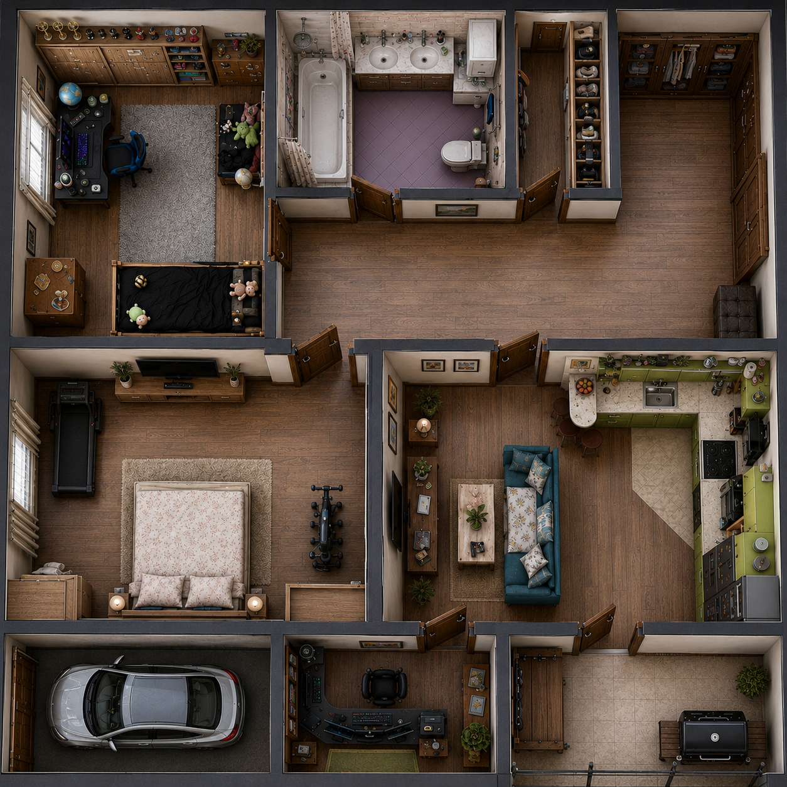
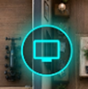
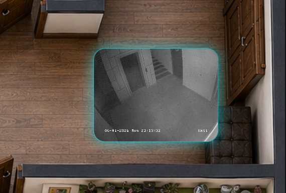

# Lesson 04 — Active TV Button + Live Camera for Home Assistant 3D Dashboard



## 🇺🇦 Опис уроку

У цьому уроці ми продовжуємо створювати **3D Dashboard у Home Assistant** на основі плану квартири.  
Це **заняття 4**, де ми додаємо на наш 3D-план два нових інтерактивних елементи:

1. **Активну піктограму телевізора**  
2. **Live Preview камери**

Ідея цього уроку — не просто вставити готовий YAML-код, а зрозуміти логіку:  
звідки береться сутність, як її прив’язати до елемента, як розмістити елемент на плані та як зробити його візуально зрозумілим.

---

## 📁 Структура файлів уроку

```text
lesson-04-active-tv-button-live-camera/
├── 01_active_tv_button.yaml
├── 02_live_camera.yaml
├── active_tv_button.png
├── live_camera.png
├── home11.png
└── readme.md
```

### Що знаходиться у файлах

| Файл | Призначення |
|---|---|
| `01_active_tv_button.yaml` | YAML-код активної кнопки телевізора |
| `02_live_camera.yaml` | YAML-код Live Preview камери |
| `active_tv_button.png` | Зображення прикладу активної TV-піктограми |
| `live_camera.png` | Зображення прикладу Live Preview камери |
| `home11.png` | Основний 3D-план квартири, на якому розміщуються елементи |
| `readme.md` | Опис уроку та покрокова інструкція |

---

## 🧩 Що ми робимо в цьому уроці

У цьому занятті ми беремо наш готовий 3D-план квартири та додаємо на нього два елементи керування:

- кнопку телевізора;
- live-зображення з камери.

Для цього використовується картка Home Assistant:

```yaml
type: picture-elements
```

Саме вона дозволяє накладати різні елементи поверх зображення: кнопки, іконки, камери, датчики, димери, підписи та інші інтерактивні об’єкти.

---

## 🖼️ Основне зображення дашборду

Основою нашого дашборду є файл:

```text
home11.png
```

Це 3D-план квартири, на якому ми розміщуємо всі елементи.

Приклад базової структури:

```yaml
type: picture-elements
image: /local/home11.png
elements:
  # Тут будуть наші елементи
```

> Важливо: шлях до зображення може відрізнятися залежно від того, куди саме ви завантажили файл у Home Assistant.  
> Найчастіше файли кладуть у папку `www`, а в Lovelace вони доступні через шлях `/local/назва_файлу.png`.

---

## 📺 Частина 1 — Активна кнопка телевізора



Перший елемент, який ми додаємо, — це активна кнопка телевізора.

Вона потрібна для того, щоб на 3D-плані було видно, де знаходиться телевізор, і щоб по натисканню можна було керувати потрібною сутністю Home Assistant.

Наприклад, це може бути:

```yaml
entity: media_player.tv
```

або інша сутність, яка відповідає за ваш телевізор:

```yaml
entity: media_player.living_room_tv
```

---

## 🔎 Крок 1. Знаходимо сутність телевізора

Спочатку потрібно знайти правильну сутність телевізора у Home Assistant.

Для цього відкриваємо:

```text
Налаштування → Пристрої та служби → Сутності
```

Або переходимо в **Developer Tools / Інструменти розробника** і шукаємо сутність телевізора.

Нам потрібно щось подібне до:

```yaml
media_player.tv
```

або:

```yaml
media_player.samsung_tv
```

або:

```yaml
media_player.lg_webos_tv
```

---

## 🔎 Крок 2. Створюємо елемент `custom:button-card`

Для активної кнопки телевізора ми використовуємо:

```yaml
type: custom:button-card
```

Цей тип картки зручний тим, що дозволяє налаштовувати:

- іконку;
- колір;
- розмір;
- фон;
- світіння;
- дію при натисканні;
- поведінку залежно від стану пристрою.

Базова логіка виглядає так:

```yaml
- type: custom:button-card
  entity: media_player.tv
  icon: mdi:television
  show_name: false
  show_state: false
```

---

## 🔎 Крок 3. Додаємо дію при натисканні

Щоб кнопка відкривала детальну інформацію по телевізору, можна використати:

```yaml
tap_action:
  action: more-info
```

Якщо потрібно, щоб кнопка щось перемикала, можна використати:

```yaml
tap_action:
  action: toggle
```

Для телевізора найчастіше зручно використовувати саме `more-info`, тому що там можна побачити стан пристрою та доступні дії.

---

## 🔎 Крок 4. Розміщуємо кнопку на 3D-плані

Позиція елемента задається через блок:

```yaml
style:
  top: 70%
  left: 45%
```

Тут:

- `top` — відступ зверху;
- `left` — відступ зліва.

Ці значення підбираються вручну, поки піктограма не стане саме в потрібне місце на плані.

---

## 🔎 Крок 5. Додаємо стиль активної кнопки

Щоб кнопка виглядала не як стандартна іконка, а як красивий елемент 3D Dashboard, додаємо стилі:

```yaml
styles:
  card:
    - border-radius: 50%
    - background: rgba(0, 229, 255, 0.12)
    - box-shadow: 0 0 18px rgba(0, 229, 255, 0.8)
    - border: 2px solid rgba(0, 229, 255, 0.9)
  icon:
    - color: '#00e5ff'
```

Так ми отримуємо ефект неонової активної кнопки.

---

## 📷 Частина 2 — Live Preview камери



Другий елемент — це Live Preview камери.

Тут ми виводимо на план не просто іконку камери, а реальне зображення з камери Home Assistant.

Для цього використовується елемент:

```yaml
type: image
```

або камера з параметрами:

```yaml
entity: camera.network_video_recorder_channel_3
camera_image: camera.network_video_recorder_channel_3
camera_view: live
```

---

## 🔎 Крок 1. Знаходимо сутність камери

Потрібно знайти сутність камери у Home Assistant.

Приклад:

```yaml
camera.network_video_recorder_channel_3
```

У вас назва може бути іншою:

```yaml
camera.kitchen_camera
```

або:

```yaml
camera.nvr_channel_1
```

---

## 🔎 Крок 2. Додаємо камеру на picture-elements

Приклад базового коду:

```yaml
- type: image
  entity: camera.network_video_recorder_channel_3
  camera_image: camera.network_video_recorder_channel_3
  camera_view: live
  tap_action:
    action: more-info
```

Цей код додає зображення з камери прямо на план.

---

## 🔎 Крок 3. Робимо Live Preview

За live-перегляд відповідає рядок:

```yaml
camera_view: live
```

Якщо цей параметр прибрати, може показуватися лише статичне оновлюване зображення.  
Якщо залишити `camera_view: live`, Home Assistant намагатиметься показувати живий потік.

---

## 🔎 Крок 4. Налаштовуємо зовнішній вигляд камери

Щоб камера виглядала як окремий елемент дашборду, додаємо стилі:

```yaml
style:
  left: 85%
  top: 35%
  transform: translate(-50%, -50%)
  width: 150px
  border-radius: 14px
  overflow: hidden
  border: 1px solid rgba(0, 229, 255, 0.85)
  box-shadow: 0 0 16px rgba(0, 229, 255, 0.55)
  z-index: 30
```

Це додає:

- округлення кутів;
- неонову рамку;
- світіння;
- фіксовану ширину;
- позицію на плані.

---

## 🧠 Чому всі елементи в редакторі називаються `custom:button-card`

У редакторі Home Assistant у списку елементів зліва кастомні кнопки можуть показуватися як:

```text
custom:button-card
Unknown type
```

Це нормально. Home Assistant показує тип картки, а не нашу внутрішню назву.

Навіть якщо в коді написати:

```yaml
name: Телевізор
```

у списку елементів редактора все одно може залишитися `custom:button-card`.

Тому для великого 3D Dashboard краще підписувати елементи коментарями в YAML:

```yaml
# ==================================================
# 01. Телевізор — активна кнопка
# ==================================================
```

і:

```yaml
# ==================================================
# 02. Камера — Live Preview
# ==================================================
```

Так набагато легше орієнтуватися, коли елементів стає багато.

---

## 🧾 Приклад загальної структури picture-elements

```yaml
type: picture-elements
image: /local/home11.png
elements:

  # ==================================================
  # 01. Телевізор — активна кнопка
  # ==================================================
  - type: custom:button-card
    entity: media_player.tv
    icon: mdi:television
    show_name: false
    show_state: false
    tap_action:
      action: more-info
    style:
      top: 70%
      left: 45%

  # ==================================================
  # 02. Камера — Live Preview
  # ==================================================
  - type: image
    entity: camera.network_video_recorder_channel_3
    camera_image: camera.network_video_recorder_channel_3
    camera_view: live
    tap_action:
      action: more-info
    style:
      top: 35%
      left: 85%
      width: 150px
```

---

## ⚠️ Важливо

У коді з цього репозиторію потрібно замінити мої сутності на свої.

Наприклад, замість:

```yaml
entity: media_player.tv
```

поставити вашу сутність телевізора.

І замість:

```yaml
camera.network_video_recorder_channel_3
```

поставити вашу сутність камери.

---

## ✅ Що в результаті отримуємо

Після цього уроку на 3D Dashboard буде:

- активна неонова піктограма телевізора;
- Live Preview камери;
- правильне розміщення елементів на плані;
- окремі YAML-файли для кожного елемента;
- зрозуміла структура для подальшого розширення дашборду.

---

## 🔗 GitHub

Весь YAML-код із цього уроку знаходиться у цьому репозиторії:

```text
home-assistant-stack / home-assistant-3d-dashboard-course / lesson-04-active-tv-button-live-camera
```

Ви можете скопіювати потрібний файл, підставити свої сутності та адаптувати під власний дашборд.

---

## 📲 Telegram

Більше матеріалів по Home Assistant, 3D Dashboard, Deye, сонячних станціях, автоматизаціях та розумному будинку публікую в Telegram:

**ANMA Electric**  
https://t.me/anma_electric

---
## ▶️ Відео уроку
https://youtu.be/iCmSAX7AjwA

## 📚 Плейлист курсу
https://www.youtube.com/playlist?list=PLWo_AYhwCKTYjH7dXVjOddqfM8Hl3zIvo

## 🏷️ Keywords / SEO

Home Assistant, 3D Dashboard, Home Assistant Dashboard, Lovelace, Picture Elements, custom button-card, YAML, Smart Home, Home Assistant Camera, Live Camera, Home Assistant TV Button, Smart TV, Home Automation, Розумний будинок, Home Assistant українською, 3D план квартири, dashboard design, ANMA Electric.

---

## 🇬🇧 Short English Description

Lesson 04 of the Home Assistant 3D Dashboard course.  
In this lesson we add two interactive elements to a 3D apartment floorplan:

- an active TV button;
- a live camera preview.

The lesson explains how to place elements on a `picture-elements` card, connect them to Home Assistant entities, style them with YAML, and organize the dashboard code for future expansion.
