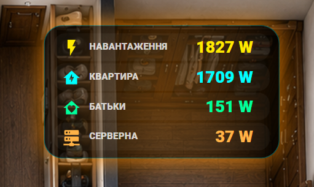

# Lesson 7 — Load Power Block + Smartphone Adaptation

У цьому занятті додаємо **блок навантаження** на наш **3D Dashboard Home Assistant** та паралельно доробляємо **адаптацію під смартфони, планшети та смарт-панелі**.

У результаті ми отримуємо вже майже фінальну версію квартири: з основним 3D-планом, адаптивними картками, коректними відступами, масштабуванням елементів та окремим блоком навантаження, який добре виглядає і на великому екрані, і на телефоні.

---

## Що робимо в цьому занятті

- додаємо блок навантаження на 3D Dashboard;
- виводимо окремими рядками:
  - загальне навантаження;
  - квартира;
  - батьки;
  - серверна;
- робимо автоматичну підсвітку залежно від потужності;
- адаптуємо блок під маленькі екрани;
- оновлюємо фінальний YAML-файл квартири з уже адаптованими піктограмами.

---

## Структура файлів

```text
lesson-07-load-power-adaptive-smartphone/
├── README.md
├── dashboard_full.png
├── load_block_example.png
└── full_apartment_dashboard_adaptive.yaml
```

---

## Що знаходиться у файлах

### `README.md`
Опис заняття, структура уроку, приклади, пояснення по файлах та коротка інструкція, що саме змінювати під себе.

### `dashboard_full.png`
Загальний вигляд усього 3D Dashboard квартири. Це повна картинка, щоб люди одразу бачили, як виглядає весь дашборд у фінальному вигляді.

### `load_block_example.png`
Окремий приклад картки, яку ми додаємо в цьому занятті — **блок навантаження**.

### `full_apartment_dashboard_adaptive.yaml`
Один фінальний YAML-файл з усією квартирою, де вже зібраний `picture-elements` дашборд з адаптивними елементами. У цьому файлі показано основну структуру фінального дашборду, включно з:

- базовим 3D-зображенням квартири;
- блоком навантаження;
- блоком батареї авто;
- кнопкою зарядки авто;
- адаптивними розмірами через `clamp()`;
- позиціюванням елементів через `top`, `left`, `transform`.

---

## Загальний дашборд


---

## Що саме додаємо у цьому занятті



У цьому уроці фокус саме на **блоці навантаження**. Це окрема адаптивна картка, у якій показується:

- **Навантаження** — загальне споживання;
- **Квартира** — споживання квартири;
- **Батьки** — окрема група;
- **Серверна** — ще одна окрема група.

Картка змінює підсвітку залежно від поточного навантаження та залишається читабельною навіть на смартфоні.

---

## На що звернути увагу

Перед використанням обов’язково замініть мої сутності на свої.

Основні сутності в цьому уроці:

- `sensor.deye_load_power` — загальне навантаження;
- `sensor.ups_power` — квартира;
- `sensor.batki_ups_power` — батьки;
- `sensor.asic_a3_sonoff_1000241bb9_power` — серверна;
- `switch.tesla_switch` — кнопка зарядки;
- `sensor.anma_charger_power_2` — потужність зарядки;
- `sensor.anma_battery_level` — заряд батареї авто.

---

## Для чого потрібен `full_apartment_dashboard_adaptive.yaml`

Це не просто окремий шматок коду, а **готовий фінальний файл дашборду**, де зібрана логіка цього етапу курсу.

Його можна використовувати як:

- основу для свого `picture-elements` дашборду;
- приклад фінальної структури квартири;
- шаблон для подальших уроків та доопрацювань.

---

## GitHub

Це заняття є частиною курсу по 3D Dashboard Home Assistant.

Рекомендована назва папки в репозиторії:

```text
lesson-07-load-power-adaptive-smartphone
```

---

## Порада

Якщо у вас блок не влазить на телефоні або виглядає занадто великим / маленьким, у першу чергу перевіряйте:

- `width`;
- `height`;
- `font-size`;
- `row-gap`;
- `padding`;
- `top` / `left`;
- усі `clamp()` значення.


Відио https://youtu.be/L1NtV5OnMRc
Саме за рахунок них ми робимо повну адаптацію під маленькі екрани.
