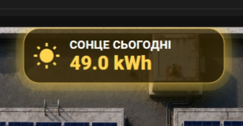

# 3D Dashboard для Home Assistant — дашборд мого даху | Заняття 8

> У цьому завданні ми починаємо збирати 3D Dashboard даху. Людина, яка зайшла в папку уроку, повинна одразу побачити: **який дашборд буде в результаті, з якого фону ми стартуємо і який саме блок робимо сьогодні.**

---

# 1. Фінальний вигляд дашборду

Ось приклад повного дашборду, до якого ми поступово рухаємося:


На фінальному дашборді буде видно:

- сонячні панелі на даху;
- PV1 / PV2 стрінги;
- мікроінвертори;
- загальну генерацію;
- батарею;
- навантаження будинку;
- камери;
- прогноз сонця;
- живі блоки з поточними значеннями;
- підсвітку та анімації активних процесів.

---

# 2. Чистий фон, з якого стартуємо

Це чиста картинка даху, на яку ми будемо накладати всі елементи Home Assistant:


Саме цей файл використовується як фон у `picture-elements`.

Файл потрібно покласти в Home Assistant сюди:

```text
/config/www/roof.png
```

Після цього в Lovelace він буде доступний так:

```text
/local/roof.png
```

У YAML це виглядає так:

```yaml
type: picture-elements
image: /local/roof.png
elements:
```

---

# 3. Що робимо саме в занятті 8

У цьому занятті ми додаємо перший живий блок — **СОНЦЕ СЬОГОДНІ**.

Ось блок, який ми сьогодні робимо:



Цей блок показує денну генерацію сонячної станції у `kWh`.

Наприклад:

```text
49.0 kWh
```

У вас це значення буде підтягуватись зі свого сенсора Home Assistant.

У прикладі використовується сенсор:

```yaml
sensor.today_sun
```

Якщо у вас інша сутність — просто замініть її в YAML-коді.

---

# 4. Структура папки уроку

Папка повинна виглядати так:

```text
lesson-08-roof-solar-dashboard/
├── README.md
├── dashboard_full.png
├── roof.png
├── sun.png
└── lesson-08-roof-solar-dashboard.yaml
```

## Що означає кожен файл

| Файл | Для чого потрібен |
|---|---|
| `README.md` | Інструкція для GitHub. Тут людина бачить результат, фон, блок заняття і код. |
| `dashboard_full.png` | Повний приклад дашборду, до якого ми йдемо. |
| `roof.png` | Чистий фон даху, який підключається в Home Assistant. |
| `sun.png` | Референс блоку “СОНЦЕ СЬОГОДНІ”, який робимо в цьому занятті. |
| `lesson-08-roof-solar-dashboard.yaml` | Готовий YAML-код заняття 8. |

---

# 5. Що потрібно перед стартом

Перед вставкою коду потрібно мати:

1. Встановлений **Home Assistant**.
2. Встановлений **HACS**.
3. Встановлену картку **`custom:button-card`**.
4. Файл **`roof.png`** у папці `/config/www/`.
5. Сенсор денного виробітку сонця, наприклад `sensor.today_sun`.

---

# 6. Покроково, що робимо

## Крок 1. Завантажуємо фон даху

Беремо файл:

```text
roof.png
```

і завантажуємо його в Home Assistant:

```text
/config/www/roof.png
```

Після цього перевіряємо, що картинка відкривається через:

```text
/local/roof.png
```

---

## Крок 2. Створюємо картку `picture-elements`

У Lovelace створюємо ручну YAML-картку і вставляємо основу:

```yaml
type: picture-elements
image: /local/roof.png
elements:
```

На цьому етапі на екрані вже має з’явитись дах.

---

## Крок 3. Додаємо блок “СОНЦЕ СЬОГОДНІ”

Далі додаємо `custom:button-card`, який показує денний виробіток сонця.

Блок має:

- іконку сонця;
- назву `СОНЦЕ СЬОГОДНІ`;
- значення у `kWh`;
- адаптивну ширину через `clamp()`;
- жовте світіння;
- анімацію, якщо генерація більше `0.1 kWh`.

---

# 7. Повний YAML-код заняття 8

```yaml
# Lesson 08 — Roof Solar Dashboard
# 3D Dashboard для Home Assistant — дашборд мого даху
#
# Перед використанням:
# 1. Завантажте файл картинки даху в Home Assistant:
#    /config/www/roof.png
# 2. У Lovelace картинка буде доступна як:
#    /local/roof.png
# 3. Перевірте, що встановлено custom:button-card через HACS.
# 4. Замініть entity на свої сенсори, якщо у вас інші назви.

# =========================
# ГОЛОВНИЙ ДАШБОРД
# =========================

type: picture-elements
image: /local/roof.png
elements:

  # =========================
  # ЗАНЯТТЯ 8
  # Секція: Сонце сьогодні
  # =========================

  - type: custom:button-card
    entity: sensor.today_sun
    name: СОНЦЕ СЬОГОДНІ
    icon: mdi:white-balance-sunny
    show_name: true
    show_state: true
    show_icon: true
    tap_action:
      action: more-info
    state_display: |
      [[[
        const v = Number(entity.state);
        if (isNaN(v)) return '0 kWh';
        return v.toFixed(1) + ' kWh';
      ]]]
    style:
      left: 50%
      top: 7%
      transform: translate(-50%, -50%)
      width: clamp(140px, 22vw, 230px)
    extra_styles: |
      @keyframes sunTotalPulse {
        0% {
          box-shadow:
            0 0 0 0 rgba(255, 210, 70, 0.65),
            0 0 12px rgba(255, 210, 70, 0.35);
        }
        50% {
          box-shadow:
            0 0 0 9px rgba(255, 210, 70, 0.08),
            0 0 26px rgba(255, 210, 70, 0.80);
        }
        100% {
          box-shadow:
            0 0 0 0 rgba(255, 210, 70, 0),
            0 0 12px rgba(255, 210, 70, 0.35);
        }
      }
    styles:
      grid:
        - grid-template-areas: '"i n" "i s"'
        - grid-template-columns: min-content 1fr
        - grid-template-rows: min-content min-content
        - column-gap: clamp(6px, 1vw, 10px)
      card:
        - background: rgba(58, 42, 5, 0.76)
        - border-radius: clamp(12px, 1.2vw, 18px)
        - padding: clamp(6px, 1vw, 10px)
        - border: 1px solid rgba(255, 210, 70, 0.95)
        - backdrop-filter: blur(8px)
        - animation: |
            [[[
              return Number(entity.state) > 0.1
                ? 'sunTotalPulse 2s ease-in-out infinite'
                : 'none';
            ]]]
      icon:
        - color: '#ffd54f'
        - width: clamp(20px, 2.6vw, 32px)
      name:
        - color: white
        - font-size: clamp(9px, 1.1vw, 13px)
        - font-weight: 700
        - letter-spacing: 0.4px
        - justify-self: start
      state:
        - color: '#ffd54f'
        - font-size: clamp(14px, 1.8vw, 22px)
        - font-weight: 800
        - justify-self: start
```

---

# 8. Де що міняти під себе

## Заміна сенсора

У коді знайдіть рядок:

```yaml
entity: sensor.today_sun
```

і замініть на свій сенсор.

Наприклад:

```yaml
entity: sensor.total_solar_energy_today
```

---

## Зміна позиції блоку

За позицію відповідають:

```yaml
left: 50%
top: 7%
```

- `left` — рухає блок ліворуч або праворуч;
- `top` — рухає блок вверх або вниз.

Наприклад, нижче:

```yaml
top: 10%
```

Лівіше:

```yaml
left: 45%
```

---

## Зміна розміру блоку

За ширину відповідає:

```yaml
width: clamp(140px, 22vw, 230px)
```

Це означає:

- мінімум: `140px`;
- адаптивно: `22vw`;
- максимум: `230px`.

Якщо блок потрібно зробити більшим:

```yaml
width: clamp(160px, 24vw, 260px)
```

---

## Формат значення

Ось цей блок робить формат `49.0 kWh`:

```yaml
state_display: |
  [[[ 
    const v = Number(entity.state);
    if (isNaN(v)) return '0 kWh';
    return v.toFixed(1) + ' kWh';
  ]]]
```

---

## Анімація світіння

Анімація вмикається тільки тоді, коли значення більше `0.1`:

```yaml
return Number(entity.state) > 0.1
  ? 'sunTotalPulse 2s ease-in-out infinite'
  : 'none';
```

Тобто:

- вдень, коли є генерація — блок світиться;
- вночі або при `0 kWh` — блок не пульсує.

---

# 9. Що має вийти після заняття

Після цього заняття у вас має бути:

- фон даху в Home Assistant;
- перший живий блок `СОНЦЕ СЬОГОДНІ`;
- значення генерації за день;
- адаптивний розмір блоку;
- жовта підсвітка;
- анімація при активній генерації.

---

# 10. Що будемо додавати далі

Далі з цього дашборду можна поступово робити повну систему моніторингу:

- поточну генерацію PV;
- PV1 / PV2;
- мікроінвертори;
- загальне PV;
- батарею;
- навантаження будинку;
- інвертор;
- мережу;
- камери;
- прогноз Solcast;
- анімовані потоки енергії.

---

# Головна логіка цього уроку

Відео: https://youtu.be/5cNPHwUvqUo

Це не просто картинка і не просто YAML.

Ми будуємо дашборд поетапно:

1. Спочатку показуємо фінальний результат — `dashboard_full.png`.
2. Потім показуємо чисту основу — `roof.png`.
3. Потім показуємо конкретний елемент заняття — `sun.png`.
4. Потім даємо YAML-код.
5. Далі пояснюємо, що і де міняти під свої сенсори.

Так людина одразу розуміє, **що вона робить, навіщо вона це робить і який результат має отримати**.
