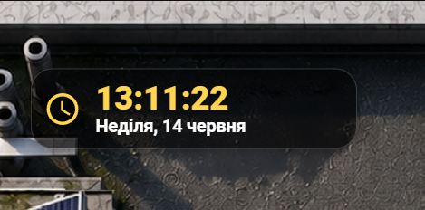
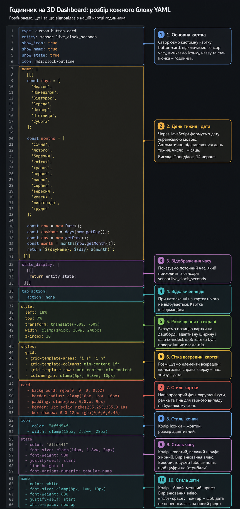
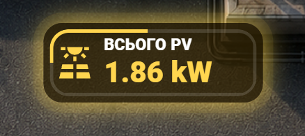
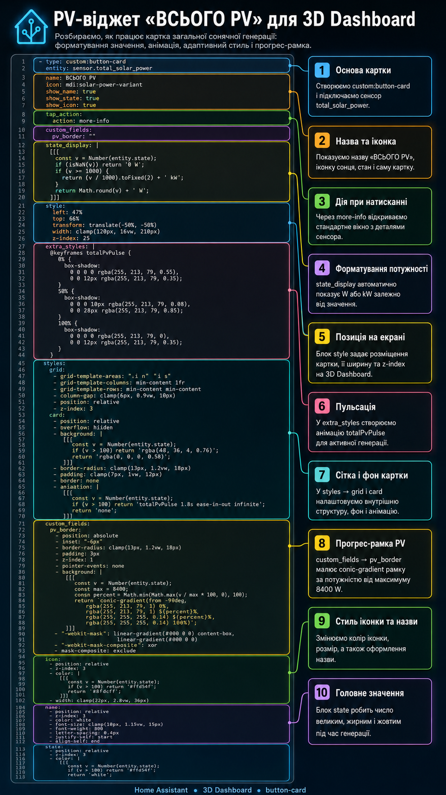

# Lesson 09 — Clock Widget + Total PV Widget для 3D Dashboard

У цьому занятті ми додаємо на 3D Dashboard два практичні інформаційні віджети:

- **Clock Widget** — віджет годинника з поточним часом, днем тижня і датою українською мовою.
- **PV Widget** — віджет загальної сонячної генерації, який показує поточну потужність PV у W або kW.

Ідея уроку проста: спочатку дивимось на готовий результат на повному дашборді, потім окремо розбираємо кожний віджет, після цього дивимось YAML-код і пояснення по блоках.

---

## Що робимо в цьому уроці

У цьому занятті ми не просто додаємо цифри на екран, а робимо нормальні візуальні елементи для 3D Dashboard.

Ми додаємо:

1. віджет часу у верхню частину дашборду;
2. віджет загальної сонячної генерації у центральну частину дашборду;
3. адаптивне позиціонування через `left`, `top`, `width` і `clamp`;
4. красивий темний фон, рамки, тіні та кольори;
5. автоматичне форматування значень через JavaScript;
6. окремі пояснювальні картинки, де кожний блок YAML розібраний по частинах.

---

## Готовий результат

Спочатку дивимось на повний вигляд 3D Dashboard.


На цьому екрані видно, як два нові віджети виглядають у реальному інтерфейсі:

- зверху зліва — **Clock Widget**;
- по центру — **PV Widget**.

Це фінальний результат, до якого ми приходимо в цьому занятті.

---

## Clock Widget



Цей віджет показує:

- поточний час;
- день тижня;
- дату українською мовою;
- іконку годинника;
- адаптивний розмір під різні екрани.

YAML-код знаходиться у файлі:

```text
lesson-09-clock-widget.yaml
```

### Що робить Clock Widget

Спочатку ми створюємо картку через `custom:button-card`.

Далі підключаємо сенсор:

```yaml
sensor.live_clock_seconds
```

Саме цей сенсор відповідає за поточний час із секундами.

Потім через JavaScript формуємо день тижня і місяць українською мовою.

Після цього налаштовуємо стилі: темний фон, жовтий колір часу, білу дату, іконку, сітку всередині картки та адаптивний розмір.

---

## Розбір Clock Widget по блоках



На цій картинці YAML-код розділений на окремі блоки.

Тут показано:

- де створюється сама картка;
- де підключається сенсор часу;
- де формується дата українською;
- де виводиться стан сенсора;
- де вимикається дія при натисканні;
- де задається позиція на екрані;
- де налаштовується сітка;
- де задаються стилі картки, іконки, часу та дати.

Це потрібно для того, щоб було зрозуміло не просто що вставити, а який блок YAML за що відповідає.

---

## PV Widget



Цей віджет показує загальну потужність сонячних панелей.

Він автоматично:

- показує значення у W або kW;
- змінює колір при активній генерації;
- вмикає пульсацію, коли сонце реально дає потужність;
- показує прогрес-рамку навколо картки;
- використовує максимальне значення 8400 W для розрахунку заповнення рамки.

YAML-код знаходиться у файлі:

```text
lesson-09-total-pv-widget.yaml
```

### Що робить PV Widget

Спочатку ми створюємо картку через `custom:button-card`.

Далі підключаємо сенсор:

```yaml
sensor.total_solar_power
```

Цей сенсор показує загальну потужність сонячної генерації.

Через `state_display` ми форматуємо значення: якщо потужність більша за 1000 W, показуємо її у kW, якщо менша — залишаємо у W.

Далі додаємо анімацію, зміну кольору, прогрес-рамку через `conic-gradient` і адаптивне позиціонування на дашборді.

---

## Розбір PV Widget по блоках



На цій картинці код PV-віджета розбитий на логічні частини.

Тут показано:

- де створюється основа картки;
- де задається назва та іконка;
- де відкривається `more-info` при натисканні;
- де формується значення W або kW;
- де задається позиція на екрані;
- де створюється пульсація;
- де налаштовується фон і внутрішня сітка;
- де створюється прогрес-рамка PV;
- де задається стиль іконки, назви та головного значення.

Такий розбір допомагає швидко зрозуміти структуру YAML і змінити віджет під свої сутності.

---

## Структура файлів уроку

```text
lesson-09-clock-total-pv-widgets/
├── README.md
├── dashboard_full.png
├── clock-widgets.png
├── pv-widgets.png
├── time.png
├── pv.png
├── lesson-09-clock-widget.yaml
└── lesson-09-total-pv-widget.yaml
```

---

## Як повторити у себе

1. Відкрити Home Assistant.
2. Перейти у потрібний dashboard.
3. Відкрити редагування картки.
4. Вставити YAML-код з потрібного файлу.
5. Замінити сутності на свої, якщо вони відрізняються.
6. Перевірити позицію `left`, `top` і `width`.
7. За потреби змінити кольори, розмір або максимальне значення PV.

---

## Важливо

Для роботи цих прикладів потрібна картка:

```text
custom:button-card
```

Її можна встановити через HACS.

Також потрібно, щоб у Home Assistant вже існували відповідні сенсори:

```yaml
sensor.live_clock_seconds
sensor.total_solar_power
```

Якщо у вас інші назви сутностей, просто замініть їх у YAML-коді на свої.

---

## Що можна змінити під себе

У Clock Widget можна змінити:

- позицію на екрані;
- розмір картки;
- колір часу;
- формат дати;
- іконку;
- прозорість фону.

У PV Widget можна змінити:

- сенсор сонячної генерації;
- максимальну потужність PV;
- поріг активації анімації;
- колір активної генерації;
- ширину і положення картки;
- силу світіння та пульсації.

---
Посилання на відио: https://youtu.be/1tI1tuKkCgQ
## Підсумок

У цьому занятті ми додали два корисні елементи для 3D Dashboard:

- красивий віджет годинника;
- живий PV-віджет для сонячної генерації.

Ці два блоки роблять дашборд більш інформативним і візуально зрозумілим.

Головна ідея уроку — не просто скопіювати YAML, а зрозуміти, який блок за що відповідає.
