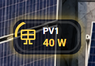
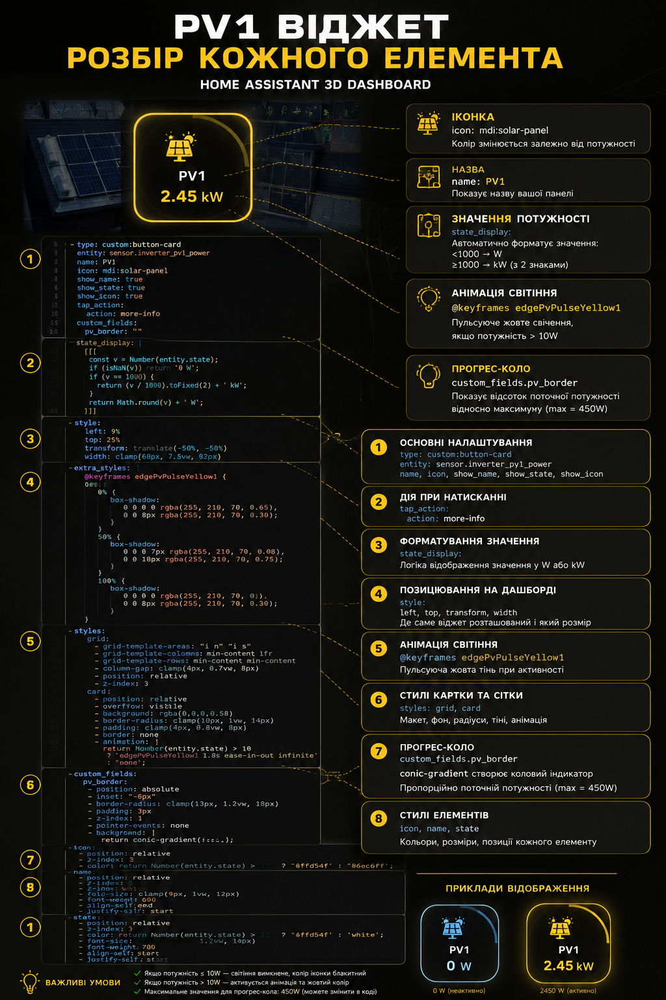
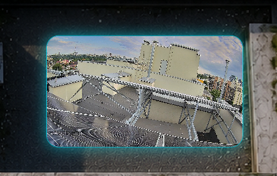
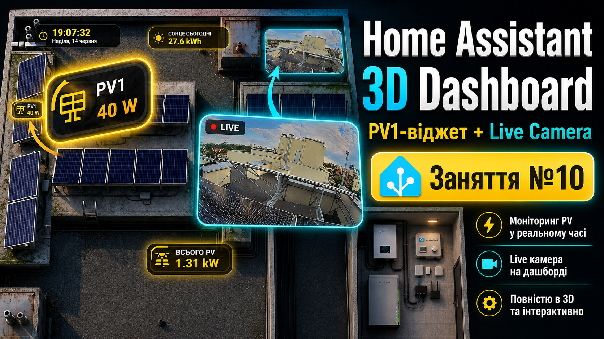

# Lesson 10 — PV1 Widget + Live Camera Widget для 3D Dashboard

У цьому занятті ми продовжуємо збирати **Home Assistant 3D Dashboard** і додаємо два нові практичні блоки:

- **PV1 Widget** — маленький віджет для окремої сонячної панелі або окремого PV-стрінга.
- **Live Camera Widget** — віджет живої камери прямо на 3D Dashboard.

Ідея уроку така: спочатку показуємо повний дашборд, потім окремо розбираємо кожний віджет, показуємо його крупним планом, після цього відкриваємо YAML-файли і пояснюємо код по блоках.

---

## Що робимо в цьому уроці

У Lesson 10 ми додаємо на дашборд ще два інтерактивні елементи.

Перший елемент — це **PV1-віджет**. Він показує потужність окремої сонячної панелі або стрінга, автоматично переводить значення з W у kW, змінює колір при активній генерації та має прогрес-рамку.

Другий елемент — це **Live Camera-віджет**. Він показує живий відеопотік з камери прямо на нашому 3D Dashboard, має адаптивний розмір, округлення, рамку і блакитне світіння.

---

## Готовий результат

Спочатку дивимось на повний вигляд дашборду.


На цьому скріні видно, де саме розміщені наші нові елементи:

- зліва біля панелей — **PV1 Widget**;
- справа зверху — **Live Camera Widget**.

Це фінальний вигляд, до якого ми приходимо в цьому занятті.

---

## PV1 Widget



PV1-віджет показує поточну потужність окремої панелі або окремого PV-каналу.

У цьому прикладі ми використовуємо сутність:

```yaml
sensor.inverter_pv1_power
```

YAML-код знаходиться у файлі:

```text
lesson-10-pv1-widget.yaml
```

### Що робить PV1 Widget

Спочатку ми створюємо картку через `custom:button-card`.

Далі підключаємо сенсор `sensor.inverter_pv1_power`.

Потім задаємо назву `PV1`, іконку сонячної панелі та вмикаємо показ назви, стану й іконки.

Через `state_display` ми форматуємо значення: якщо потужність менша за 1000 W — показуємо W, якщо більша — переводимо у kW.

Далі задаємо позицію віджета на дашборді через `left`, `top`, `transform` і `width`.

Після цього додаємо анімацію світіння: якщо PV1 дає більше 10 W, картка починає пульсувати жовтим кольором.

Окремо створюємо `pv_border` — це прогрес-рамка навколо картки, яка показує поточну потужність відносно максимуму.

---

## Розбір PV1 Widget по блоках



На цій картинці код PV1-віджета розбитий на логічні частини.

Тут показано:

- де створюється основа картки;
- де підключається сенсор PV1;
- де задається назва та іконка;
- де працює форматування W/kW;
- де задається позиція на дашборді;
- де створюється анімація світіння;
- де створюється прогрес-рамка;
- де налаштовуються стилі іконки, назви та значення.

Це потрібно для того, щоб було зрозуміло не просто що вставити, а який блок YAML за що відповідає.

---

## Live Camera Widget



Live Camera-віджет показує живу камеру прямо на 3D Dashboard.

У цьому прикладі ми використовуємо сутність:

```yaml
camera.network_video_recorder_channel_1
```

YAML-код знаходиться у файлі:

```text
lesson-10-live-camera-widget.yaml
```

### Що робить Live Camera Widget

Спочатку ми використовуємо тип картки `image`.

Далі вказуємо entity камери через `entity` і `camera_image`.

Параметр `camera_view: live` означає, що ми показуємо не статичний кадр, а живий потік з камери.

Через `tap_action: more-info` робимо так, щоб при натисканні відкривалась детальна інформація по камері.

У блоці `style` задаємо позицію камери на дашборді: `left`, `top`, `transform` і `width`.

Через `clamp` робимо розмір адаптивним, щоб камера нормально виглядала на різних екранах.

Потім додаємо оформлення: округлення кутів, обрізання зайвого через `overflow: hidden`, блакитну рамку і світіння.

---

## Розбір Live Camera Widget по блоках



На цій картинці YAML-код камери розділений на окремі частини.

Тут показано:

- де задається тип картки;
- де підключається камера;
- де вмикається live-режим;
- де налаштовується дія при натисканні;
- де задається позиція та розмір;
- де додається округлення, рамка і світіння.

Такий розбір допомагає швидко зрозуміти структуру коду і змінити камеру під свої сутності.

---

## Структура файлів уроку

```text
lesson-10-pv1-live-camera-widget/
├── README.md
├── dashboard_full.png
├── pv1-widget.png
├── pv1-widget-explained.png
├── camera-widget.png
├── camera-widget-explained.png
├── lesson-10-pv1-widget.yaml
└── lesson-10-live-camera-widget.yaml
```

---

## Як повторити у себе

1. Відкрити Home Assistant.
2. Перейти у потрібний 3D Dashboard.
3. Відкрити редагування дашборду.
4. Додати або вставити YAML-код потрібного віджета.
5. Замінити сутності на свої, якщо вони відрізняються.
6. Перевірити позицію `left`, `top` і `width`.
7. Для PV1-віджета перевірити максимальне значення у коді.
8. Для камери перевірити, чи підтримує вона live stream у Home Assistant.

---

## Важливо для PV1 Widget

Для PV1-віджета потрібна картка:

```text
custom:button-card
```

Її можна встановити через HACS.

Також потрібен сенсор потужності PV1, наприклад:

```yaml
sensor.inverter_pv1_power
```

Якщо у вас інша назва сенсора, замініть її у YAML-коді.

---

## Важливо для Live Camera Widget

Для камери потрібно, щоб у Home Assistant вже була додана camera entity.

У прикладі використовується:

```yaml
camera.network_video_recorder_channel_1
```

Якщо у вас інша камера, замініть entity на свою.

Також важливо, щоб камера нормально відкривалась у Home Assistant і підтримувала live-перегляд.

---

## Що можна змінити під себе

У PV1 Widget можна змінити:

- назву віджета;
- іконку;
- сенсор потужності;
- максимальне значення для прогрес-рамки;
- поріг активації анімації;
- позицію на дашборді;
- колір світіння;
- розмір картки.

У Live Camera Widget можна змінити:

- camera entity;
- позицію на дашборді;
- ширину камери;
- радіус округлення;
- колір рамки;
- силу світіння;
- дію при натисканні.

---

## Підсумок

У цьому занятті ми додали два нові блоки для Home Assistant 3D Dashboard:

- **PV1 Widget** — для моніторингу окремої сонячної панелі або стрінга;
- **Live Camera Widget** — для перегляду камери прямо на дашборді.

Головна ідея уроку — не просто вставити YAML, а зрозуміти, як кожний блок працює і за що відповідає.
