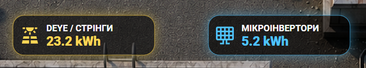
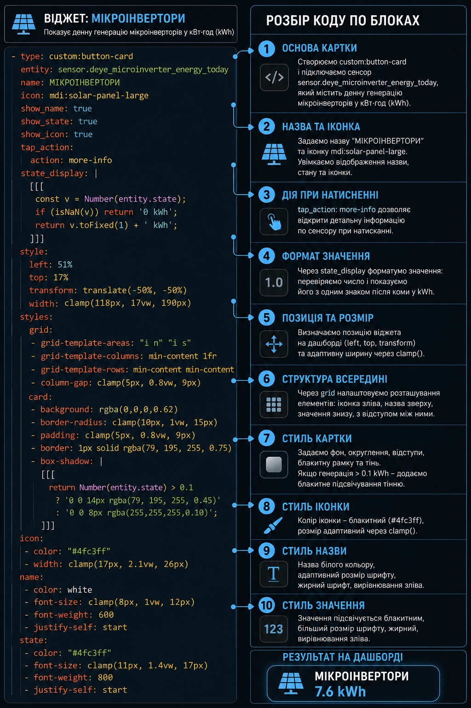
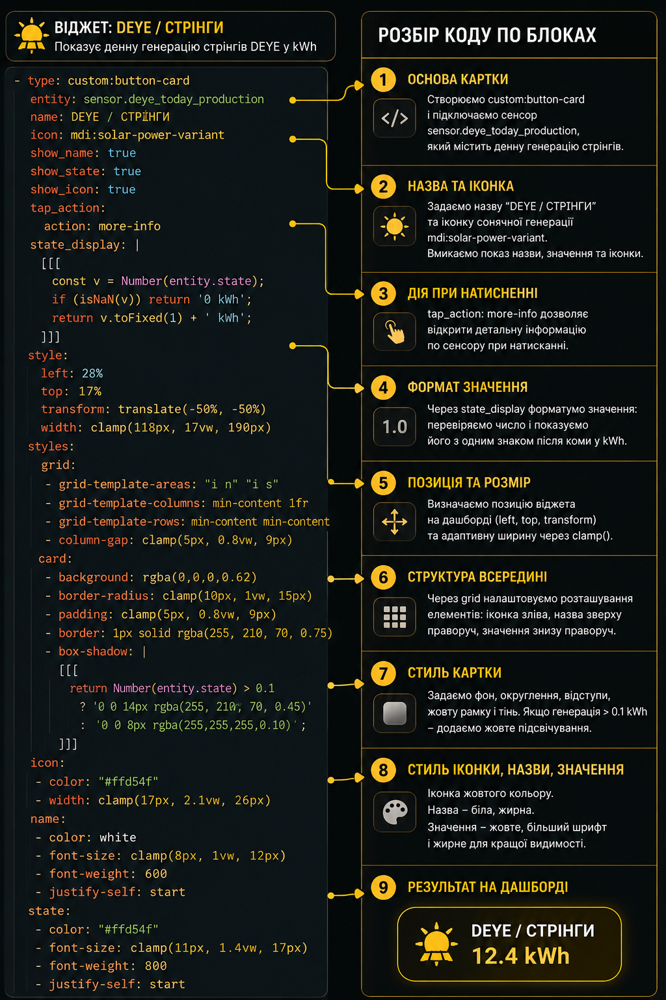
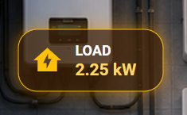
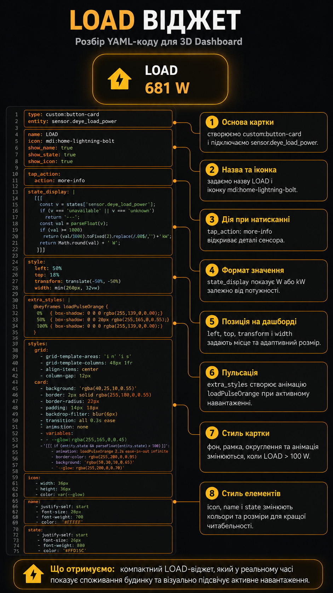
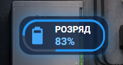
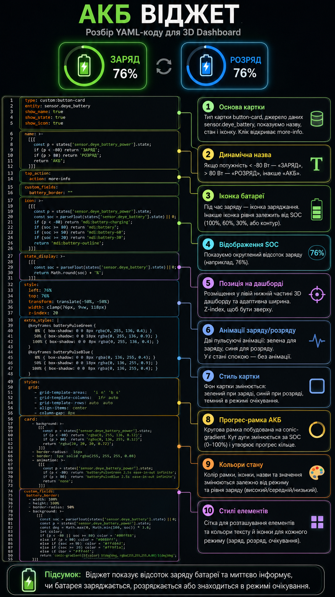

# Lesson 11 — Microinverter, LOAD і Battery Widgets для 3D Dashboard

У цьому занятті ми продовжуємо збирати **Home Assistant 3D Dashboard** і додаємо три важливі енергетичні блоки:

- **Microinverter Widget** — показує денну генерацію мікроінверторів у kWh.
- **LOAD Widget** — показує поточне споживання будинку у W або kW.
- **Battery Widget** — показує заряд батареї, а також режим роботи: заряд, розряд або спокій.

Головна ідея уроку — зробити дашборд не просто красивим, а корисним: щоб одразу бачити, звідки йде генерація, скільки зараз споживає будинок і що в цей момент робить батарея.

---

## Готовий результат

Спочатку дивимось на повний вигляд 3D Dashboard.


На цьому екрані видно всі основні енергетичні блоки:

- зверху — загальна генерація за день;
- окремо — **DEYE / СТРІНГИ**;
- окремо — **МІКРОІНВЕРТОРИ**;
- справа в технічній кімнаті — **LOAD**;
- нижче — **Battery / АКБ**;
- по центру — загальний PV-блок.

У цьому уроці нас цікавлять саме нові блоки: мікроінвертори, LOAD і батарея.

---

## Що робимо в цьому уроці

У Lesson 11 ми додаємо три окремі YAML-віджети.

Перший віджет показує генерацію мікроінверторів. Це потрібно, щоб бачити їх окремо від основних стрінгів Deye.

Другий віджет показує поточне навантаження будинку. Це допомагає швидко зрозуміти, скільки зараз реально споживається енергії.

Третій віджет показує стан батареї. Він не тільки показує відсоток заряду, а й змінює назву, колір і анімацію залежно від того, батарея заряджається чи розряджається.

---

## Microinverter Widget



Цей віджет показує денну генерацію мікроінверторів у kWh.

У прикладі використовується сутність:

```yaml
sensor.deye_microinverter_energy_today
```

YAML-код знаходиться у файлі:

```text
lesson-11-microinverter-widget.yaml
```

### Що робить Microinverter Widget

Ми створюємо `custom:button-card`, підключаємо сенсор мікроінверторів, задаємо назву **МІКРОІНВЕРТОРИ** та іконку сонячної панелі.

Через `state_display` значення завжди показується у форматі kWh з одним знаком після коми.

Картка має блакитне оформлення: рамку, іконку, значення і світіння.

Якщо генерація більше `0.1 kWh`, віджет підсвічується сильніше. Якщо генерації майже немає — світіння стає мінімальним.

### Розбір Microinverter Widget по блоках



На цій картинці YAML-код розбитий на логічні частини:

- основа картки;
- підключення сенсора;
- назва та іконка;
- дія при натисканні;
- формат значення;
- позиція на дашборді;
- структура всередині картки;
- стиль картки;
- стиль іконки;
- стиль назви та значення.

---

## DEYE / PV Widget



У папці також є пояснення для блоку **DEYE / СТРІНГИ**.

Цей блок показує денну генерацію основних стрінгів Deye.

У прикладі використовується сутність:

```yaml
sensor.deye_today_production
```

YAML-код знаходиться у файлі:

```text
lesson-11-PVinverter-widget.yaml
```

Цей блок потрібен для того, щоб окремо бачити, скільки енергії за день дали саме основні стрінги інвертора Deye.

---

## LOAD Widget



LOAD-віджет показує поточне споживання будинку або навантаження з інвертора.

У прикладі використовується сутність:

```yaml
sensor.deye_load_power
```

YAML-код знаходиться у файлі:

```text
lesson-11-load-widget.yaml
```

### Що робить LOAD Widget

Ми створюємо `custom:button-card` і підключаємо сенсор потужності навантаження.

Через `state_display` значення автоматично показується у W або kW:

- якщо значення менше `1000 W` — показуємо W;
- якщо значення більше або дорівнює `1000 W` — переводимо у kW.

Картка має помаранчеве оформлення. Якщо навантаження більше `100 W`, фон стає теплішим, рамка яскравішою, а віджет починає пульсувати.

Так одразу видно, коли будинок реально споживає енергію.

### Розбір LOAD Widget по блоках



На цій картинці показано:

- де створюється основа картки;
- де підключається `sensor.deye_load_power`;
- де задається назва LOAD та іконка;
- де відкривається `more-info`;
- де працює форматування W/kW;
- де задається позиція на дашборді;
- де створюється помаранчева пульсація;
- де змінюються фон, рамка, іконка і значення.

---

## Battery Widget



Battery-віджет показує заряд батареї та режим її роботи.

У прикладі використовуються дві сутності:

```yaml
sensor.deye_battery
sensor.deye_battery_power
```

YAML-код знаходиться у файлі:

```text
lesson-11-battery-widget.yaml
```

### Що робить Battery Widget

Цей віджет бере SOC батареї з `sensor.deye_battery` і показує його у відсотках.

Також він дивиться на `sensor.deye_battery_power`, щоб зрозуміти режим роботи:

- якщо потужність менша за `-80 W` — батарея заряджається;
- якщо потужність більша за `80 W` — батарея розряджається;
- якщо значення близьке до нуля — батарея у спокої.

Назва картки змінюється автоматично:

- **ЗАРЯД** — коли батарея заряджається;
- **РОЗРЯД** — коли батарея віддає енергію;
- **АКБ** — коли батарея у спокійному режимі.

Іконка батареї також змінюється залежно від рівня заряду.

### Розбір Battery Widget по блоках



На цій картинці YAML-код батареї розбитий на частини:

- основа картки;
- динамічна назва;
- динамічна іконка;
- відображення SOC;
- позиція на дашборді;
- зелена анімація заряду;
- синя анімація розряду;
- фон картки залежно від режиму;
- прогрес-рамка батареї;
- кольори іконки, назви та значення.

---

## Структура файлів уроку

```text
lesson-11-microinverter-load-battery-widgets/
├── README.md
├── dashboard_full.png
├── PV-widget-explained.png
├── microinverter-PV-widget.png
├── microinverter-widget-explained.png
├── load-widget.png
├── load-widget-explained.png
├── battery-widget.png
├── battery-widget-explained.png
├── lesson-11-PVinverter-widget.yaml
├── lesson-11-microinverter-widget.yaml
├── lesson-11-load-widget.yaml
└── lesson-11-battery-widget.yaml
```

---

## Як повторити у себе

1. Відкрити Home Assistant.
2. Перейти у свій 3D Dashboard.
3. Відкрити редагування дашборду.
4. Вставити YAML-код потрібного віджета.
5. Замінити сутності на свої, якщо у вас інші назви.
6. Перевірити позиції `left`, `top`, `width`.
7. Перевірити, чи встановлений `custom:button-card`.
8. За потреби змінити кольори, розміри, пороги активації та максимальні значення.

---

## Потрібні сутності

У цьому уроці використовуються такі сутності:

```yaml
sensor.deye_today_production
sensor.deye_microinverter_energy_today
sensor.deye_load_power
sensor.deye_battery
sensor.deye_battery_power
```

Якщо у вашому Home Assistant сутності називаються інакше, просто замініть їх у YAML-файлах на свої.

---

## Що можна змінити під себе

У віджетах можна змінити:

- назви;
- іконки;
- позицію на дашборді;
- ширину карток;
- кольори рамок;
- силу світіння;
- пороги активації анімації;
- формат відображення значень;
- сенсори під вашу систему.

---

## Підсумок

У цьому занятті ми додали три важливі енергетичні блоки для Home Assistant 3D Dashboard:

- **Microinverter Widget** — окрема генерація мікроінверторів;
- **LOAD Widget** — поточне споживання будинку;
- **Battery Widget** — заряд, розряд і рівень батареї.

У результаті дашборд стає набагато інформативнішим: ми бачимо генерацію, навантаження і стан АКБ в одному місці.

Головна ідея уроку — не просто вставити YAML, а зрозуміти, як кожний блок працює і як його адаптувати під свою систему.
