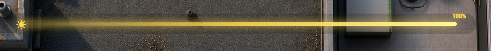
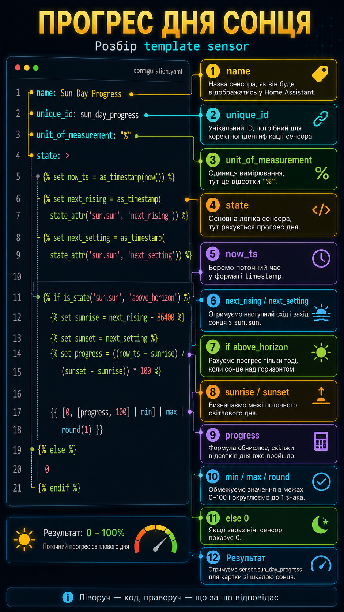
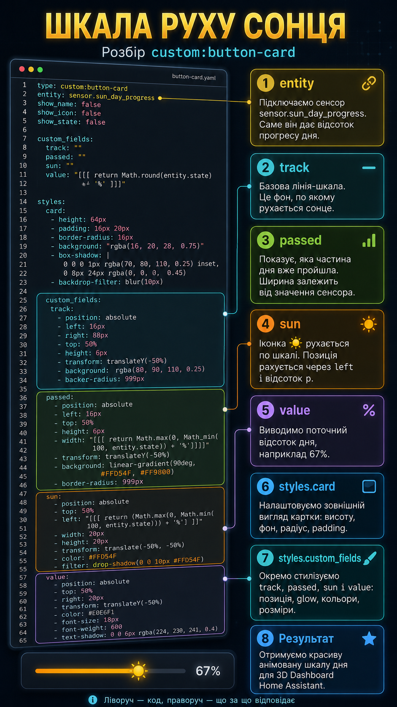

# Lesson 12 — Sun Day Progress Widget

У цьому занятті ми додаємо на **Home Assistant 3D Dashboard** красиву шкалу руху сонця.

Вона показує, скільки відсотків світлового дня вже пройшло, і рухає іконку сонця по лінії.

> Не переписуйте YAML з екрана вручну.  
> Повний код знаходиться в цьому GitHub-репозиторії.

---

## 1. Головний вигляд Dashboard

Спочатку дивимося на загальний вигляд нашого дашборду, куди ми будемо додавати новий елемент.


---

## 2. Зразок, що саме ми будемо робити

Ось приклад готової шкали прогресу світлового дня.

Це той елемент, який ми будемо додавати на Dashboard: лінія, іконка сонця, підсвітка та відсоток прогресу дня.



---

## 3. Що буде в результаті

Після заняття ми отримаємо нову сутність у Home Assistant:

```yaml
sensor.sun_day_progress
```

І вже на основі цієї сутності зробимо красиву картку через `custom:button-card`.

Схема проста:

```text
Template Sensor → sensor.sun_day_progress → custom:button-card → шкала сонця на Dashboard
```

---

## 4. Файли уроку

У папці заняття знаходяться всі файли, які потрібні для повторення цього прикладу.

```text
lesson-12-sun-progress-template-and-card/
├── 01-sun-day-progress-template-sensor.yaml
├── 02-sun-day-progress-button-card.yaml
├── dashboard_full (1).png
├── sun-day-progress.png
├── sun-day-progress-template-explained.png
├── sun-day-progress-card-explained.png
└── README.md
```

---

## 5. Файл №1 — Template Sensor

Перший файл:

```text
01-sun-day-progress-template-sensor.yaml
```

Цей код додається в `template` Home Assistant.

Саме він створює сенсор:

```yaml
sensor.sun_day_progress
```

Сенсор рахує прогрес світлового дня від `0` до `100%`.

### Пояснення коду Template Sensor

На цьому зображенні показано, що за що відповідає в першому YAML-файлі.



### Що робить цей код

- бере поточний час;
- бере наступний схід сонця;
- бере наступний захід сонця;
- перевіряє, чи сонце зараз над горизонтом;
- рахує, скільки відсотків світлового дня вже пройшло;
- обмежує результат у межах `0–100%`;
- вночі показує `0`.

---

## 6. Файл №2 — Dashboard Button Card

Другий файл:

```text
02-sun-day-progress-button-card.yaml
```

Це вже сама картка для Dashboard.

Вона використовує готову сутність:

```yaml
sensor.sun_day_progress
```

І малює візуальну шкалу руху сонця.

### Пояснення коду Button Card

На цьому зображенні показано, які блоки відповідають за лінію, прогрес, іконку сонця, відсоток і стилі.



### Що робить цей код

- створює `custom:button-card`;
- підключає сенсор `sensor.sun_day_progress`;
- малює базову лінію `track`;
- малює пройдену частину дня `passed`;
- рухає іконку сонця `sun`;
- показує поточний відсоток `value`;
- додає світіння, градієнти та адаптивні розміри.

---

## 7. Куди вставляти код

### Template Sensor

Файл:

```text
01-sun-day-progress-template-sensor.yaml
```

Вставляємо у блок `template`.

Приклад структури:

```yaml
template:
  - sensor:
      - name: Sun Day Progress
        unique_id: sun_day_progress
        unit_of_measurement: "%"
        state: >
          ...
```

Якщо у вас template-сенсори винесені в окремий файл, тоді вставляйте цей код у свій `template.yaml` або відповідний файл із template-сенсорами.

Після додавання коду потрібно перезавантажити template-сенсори або перезапустити Home Assistant.

---

### Dashboard Card

Файл:

```text
02-sun-day-progress-button-card.yaml
```

Вставляємо у потрібне місце Dashboard, де використовується `picture-elements` або інша YAML-структура дашборду.

Картка використовує:

```yaml
type: custom:button-card
entity: sensor.sun_day_progress
```

Тому перед використанням має бути встановлений `custom:button-card` через HACS.

---

## 8. Назва віджета

Англійська назва:

```text
Sun Day Progress Widget
```

Українська назва:

```text
Шкала прогресу світлового дня
```

Короткий опис:

```text
Анімована шкала руху сонця для Home Assistant 3D Dashboard.
```

---

## 9. Текст для відео

Повний YAML-код не потрібно переписувати з екрана вручну.

Усі файли з цього заняття знаходяться в цьому GitHub-репозиторії:

```text
01 — template sensor для створення sensor.sun_day_progress
02 — готова custom:button-card для Dashboard
```

Спочатку ми створюємо сенсор прогресу світлового дня, а потім використовуємо його для красивої шкали руху сонця на нашому 3D Dashboard.

---

## 10. Результат

У результаті отримуємо живий елемент для Home Assistant Dashboard:

```text
сонце рухається по лінії залежно від прогресу світлового дня
```

Це виглядає не як сухий сенсор, а як нормальний візуальний елемент для красивого 3D Dashboard.
