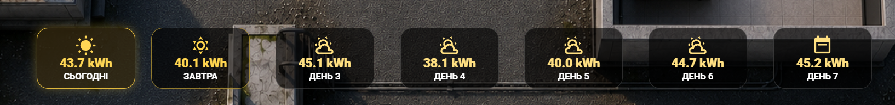
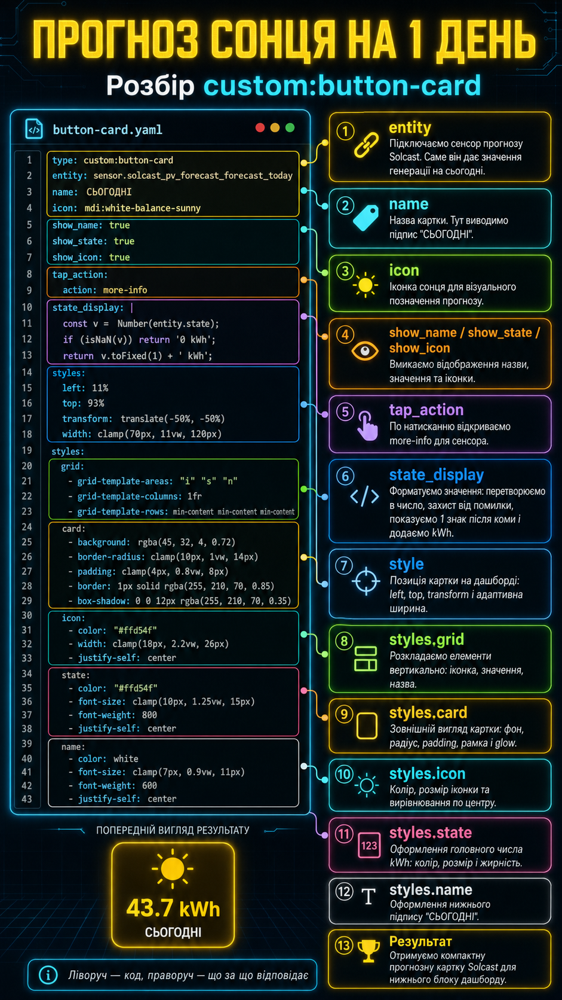

# Lesson 13 — Solcast 7 Day Forecast Cards

У цьому занятті ми додаємо на **Home Assistant 3D Dashboard** нижній блок прогнозу сонячної генерації від **Solcast** на 7 днів.

Це компактні картки, які показують прогноз виробітку сонця у `kWh`:

- сьогодні
- завтра
- день 3
- день 4
- день 5
- день 6
- день 7

Усі картки зроблені через `custom:button-card`.

Головна ідея проста: **всі картки мають однакову структуру**, а міняються тільки:

```yaml
entity:
name:
left:
```

---

## 1. Головний вигляд дашборду


На цьому зображенні видно повний вигляд 3D Dashboard і місце, де розміщений нижній блок прогнозу Solcast.

---

## 2. Що будемо робити



У цьому уроці ми створюємо нижній ряд карток прогнозу сонячної генерації на 7 днів.

Кожна картка показує прогноз Solcast у `kWh`.

---

## 3. Розбір коду однієї картки



Для прикладу розбираємо першу картку — **СЬОГОДНІ**.

Вона бере значення з сенсора:

```yaml
sensor.solcast_pv_forecast_forecast_today
```

і показує його у красивому форматі:

```text
43.7 kWh
```

---

## 4. Файли уроку

### `solcast-forecast-7-days-cards.yaml`

Повний YAML-код усіх семи карток прогнозу Solcast.

Цей файл можна копіювати і вставляти у свій Dashboard.

У файлі знаходяться картки:

```text
СЬОГОДНІ
ЗАВТРА
ДЕНЬ 3
ДЕНЬ 4
ДЕНЬ 5
ДЕНЬ 6
ДЕНЬ 7
```

---

## 5. Як працює одна картка

Приклад першої картки:

```yaml
type: custom:button-card
entity: sensor.solcast_pv_forecast_forecast_today
name: СЬОГОДНІ
icon: mdi:white-balance-sunny
```

Тут:

- `type: custom:button-card` — використовуємо кастомну картку.
- `entity` — підключаємо сенсор прогнозу Solcast.
- `name` — назва картки на дашборді.
- `icon` — іконка, яка буде показана зверху.

---

## 6. Форматування значення

```yaml
state_display: |
  [[[
    const v = Number(entity.state);
    if (isNaN(v)) return '0 kWh';
    return v.toFixed(1) + ' kWh';
  ]]]
```

Цей блок відповідає за красивий вивід значення.

Якщо Solcast віддає довге число, наприклад:

```text
43.742893
```

на дашборді ми бачимо:

```text
43.7 kWh
```

Якщо сенсор не віддав нормальне число, картка покаже:

```text
0 kWh
```

Це потрібно, щоб на дашборді не було `unknown`, `unavailable` або некрасивих значень.

---

## 7. Позиція картки на дашборді

```yaml
style:
  left: 11%
  top: 93%
  transform: translate(-50%, -50%)
  width: clamp(70px, 11vw, 120px)
```

Тут задається місце картки на фоні дашборду.

- `left` — позиція по горизонталі.
- `top` — позиція по вертикалі.
- `transform` — центрує картку відносно точки.
- `width: clamp(...)` — робить ширину адаптивною для різних екранів.

---

## 8. Розкладка елементів усередині картки

```yaml
grid:
  - grid-template-areas: '"i" "s" "n"'
  - grid-template-columns: 1fr
  - grid-template-rows: min-content min-content min-content
```

Цей блок розкладає елементи вертикально:

```text
іконка
значення
назва
```

Тобто зверху буде іконка сонця, посередині значення у `kWh`, а знизу назва дня.

---

## 9. Зовнішній вигляд картки

```yaml
card:
  - background: rgba(45, 32, 4, 0.72)
  - border-radius: clamp(10px, 1vw, 14px)
  - padding: clamp(4px, 0.8vw, 8px)
  - border: 1px solid rgba(255, 210, 70, 0.85)
  - box-shadow: 0 0 12px rgba(255, 210, 70, 0.35)
```

Це оформлення самої картки:

- темний прозорий фон
- закруглені кути
- внутрішній відступ
- жовта рамка
- легке світіння

Для картки **СЬОГОДНІ** я роблю рамку яскравішою, щоб поточний день одразу виділявся.

---

## 10. Як створюються всі 7 днів

Усі картки однакові.

Міняються тільки:

```yaml
entity:
name:
left:
```

Приклад для сьогодні:

```yaml
entity: sensor.solcast_pv_forecast_forecast_today
name: СЬОГОДНІ
left: 11%
```

Приклад для завтра:

```yaml
entity: sensor.solcast_pv_forecast_forecast_tomorrow
name: ЗАВТРА
left: 23.3%
```

Приклад для третього дня:

```yaml
entity: sensor.solcast_pv_forecast_forecast_day_3
name: ДЕНЬ 3
left: 36.6%
```

Позиції карток по горизонталі:

```text
11%    — СЬОГОДНІ
23.3%  — ЗАВТРА
36.6%  — ДЕНЬ 3
50%    — ДЕНЬ 4
63.3%  — ДЕНЬ 5
76.6%  — ДЕНЬ 6
90%    — ДЕНЬ 7
```

Так ми рівномірно розставляємо всі картки в один ряд у нижній частині дашборду.

---

## 11. Перед цим потрібно додати Solcast

Щоб ці картки працювали, у Home Assistant має бути додана інтеграція **Solcast PV Forecast**.

Окремо я показував, як створити Solcast API, додати інтеграцію в Home Assistant і отримати сенсори прогнозу.

Відео по Solcast:

[Як створити Solcast інтеграцію для Home Assistant](https://youtu.be/G3t3uB15jeE?si=Tb1i948qjLuIKinu)

Після встановлення Solcast у вас мають зʼявитися сенсори прогнозу, наприклад:

```yaml
sensor.solcast_pv_forecast_forecast_today
sensor.solcast_pv_forecast_forecast_tomorrow
sensor.solcast_pv_forecast_forecast_day_3
sensor.solcast_pv_forecast_forecast_day_4
sensor.solcast_pv_forecast_forecast_day_5
sensor.solcast_pv_forecast_forecast_day_6
sensor.solcast_pv_forecast_forecast_day_7
```

Якщо назви сенсорів у вас інші — просто замініть `entity` у YAML-коді під свої сутності.

---

## 12. Що потрібно для цього уроку

Потрібно, щоб у Home Assistant вже були:

- встановлений `custom:button-card`
- додана інтеграція Solcast
- створені сенсори прогнозу Solcast
- дашборд, де використовується розміщення елементів через `style: left / top`

---

## 13. Результат

У результаті отримуємо красивий нижній блок прогнозу сонячної генерації на 7 днів для **Home Assistant 3D Dashboard**.

Це зручно, бо одразу видно, скільки приблизно енергії дадуть сонячні панелі сьогодні та в наступні дні.

---

## Важливо

Не переписуйте YAML з екрана вручну.

Повний код знаходиться у файлі:

```text
solcast-forecast-7-days-cards.yaml
```
Відио заняття тут: https://youtu.be/hxcBTP9K1nU
Просто копіюйте готовий код з GitHub і замінюйте сутності під свій Home Assistant, якщо у вас вони називаються інакше.
