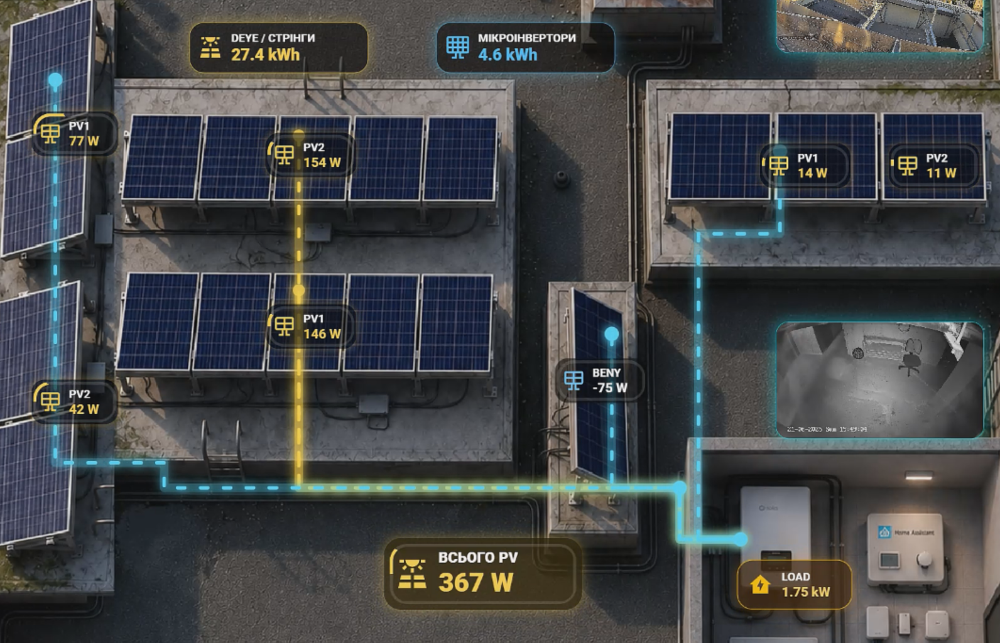
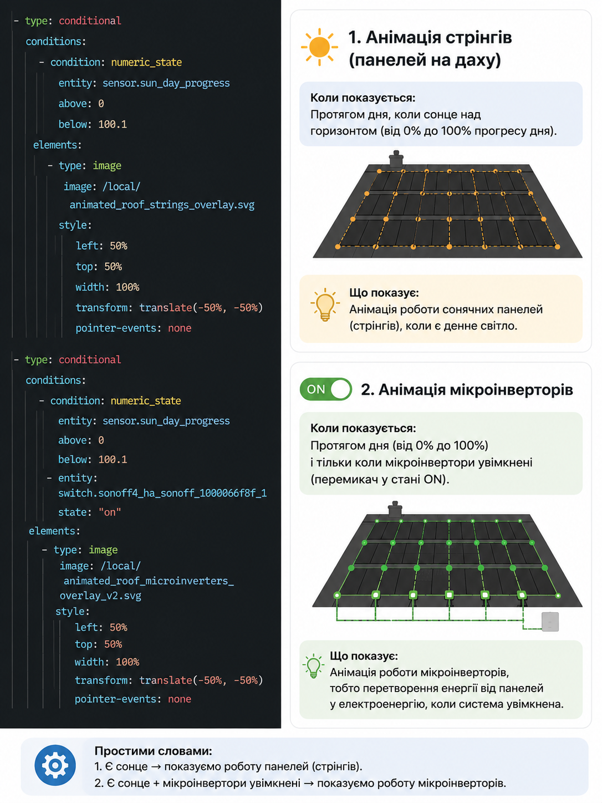

# Lesson 14 — Roof Strings & Microinverters Animation

## Home Assistant 3D Dashboard Course

У цьому занятті ми продовжуємо створювати **3D Dashboard для Home Assistant** і додаємо **анімацію стрінгів** та **анімацію мікроінверторів** поверх зображення даху.

Ідея проста:

- спочатку ми маємо **готовий full dashboard**;
- окремо маємо **зображення даху**;
- далі накладаємо на дах **SVG-анімації**;
- після цього через **YAML-логіку** керуємо, коли саме ці анімації повинні відображатися.

---

## Final Result

Нижче показаний готовий результат — як виглядає повний дашборд після додавання всіх елементів.

.png)

---

## Roof Base Image

Це базове зображення даху, на яке далі накладаються SVG-потоки та анімації.

.png)

---

## SVG Overlay Files

У цьому занятті використовуються два SVG-файли:

- `animated_roof_strings_overlay.svg`
- `animated_roof_microinverters_overlay_v2.svg`

### 1. Strings Overlay

Цей SVG-файл відповідає за **анімацію стрінгів сонячних панелей**.

```text
animated_roof_strings_overlay.svg
```

### 2. Microinverters Overlay

Цей SVG-файл відповідає за **анімацію мікроінверторів**.

```text
animated_roof_microinverters_overlay_v2.svg
```

---

## Sample Work

Нижче приклад того, як виглядає робота на практиці — коли поверх даху вже накладені анімовані елементи.



---

## YAML Code Description

Цей файл/зображення показує логіку коду та пояснення, що саме ми вмикаємо через YAML.



---

## What We Are Doing In This Lesson

У цьому уроці ми реалізовуємо дві окремі логіки.

### 1. Анімація стрінгів

Показуємо SVG-анімацію стрінгів тільки тоді, коли є день.

Для цього використовується сенсор:

```yaml
sensor.sun_day_progress
```

Якщо значення:

- **більше 0**;
- **менше 100.1**;

значить сонце над горизонтом, і ми показуємо анімацію стрінгів.

### 2. Анімація мікроінверторів

Показуємо SVG-анімацію мікроінверторів тільки тоді, коли:

- є день;
- мікроінвертори увімкнені.

Для цього додатково перевіряється перемикач:

```yaml
switch.sonoff4_ha_sonoff_1000066f8f_1
```

Якщо його стан:

```yaml
state: "on"
```

тоді анімація мікроінверторів відображається на дашборді.

---

## YAML Logic

Нижче сам YAML-код, який відповідає за цю логіку.

```yaml
- type: conditional
  conditions:
    - condition: numeric_state
      entity: sensor.sun_day_progress
      above: 0
      below: 100.1
  elements:
    - type: image
      image: /local/animated_roof_strings_overlay.svg
      style:
        left: 50%
        top: 50%
        width: 100%
        transform: translate(-50%, -50%)
        pointer-events: none

- type: conditional
  conditions:
    - condition: numeric_state
      entity: sensor.sun_day_progress
      above: 0
      below: 100.1
    - entity: switch.sonoff4_ha_sonoff_1000066f8f_1
      state: "on"
  elements:
    - type: image
      image: /local/animated_roof_microinverters_overlay_v2.svg
      style:
        left: 50%
        top: 50%
        width: 100%
        transform: translate(-50%, -50%)
        pointer-events: none
```

---

## YAML File

Основний YAML-файл цього заняття:

```text
roof-strings-microinverters-animation.yaml
```

У ньому знаходиться логіка відображення SVG-шарів на основі станів сенсорів і перемикачів у Home Assistant.

---

## File Structure

```text
lesson-14-roof-strings-microinverters-animation/
├── animated_roof_microinverters_overlay_v2.svg
├── animated_roof_strings_overlay.svg
├── code_description.png
├── dashboard_full (1).png
├── roof (1).png
├── roof-strings-microinverters-animation.yaml
├── sample_work.png
└── README.md
```

---

## Simple Explanation

Простими словами, тут ми робимо таке:

- беремо **дах** як основу;
- накладаємо на нього **SVG-анімацію стрінгів**;
- окремо накладаємо **SVG-анімацію мікроінверторів**;
- через **YAML** вирішуємо, коли що показувати;
- у результаті отримуємо **живий 3D Dashboard у Home Assistant**, який реагує на реальні стани системи.

---

## Conclusion

Це заняття показує, як зробити дашборд не просто красивим, а ще й **інформативним**.

Тобто на екрані ми бачимо не просто картинку даху, а реальну візуалізацію:

- коли працюють стрінги;
- коли працюють мікроінвертори;
- коли система активна протягом дня.
