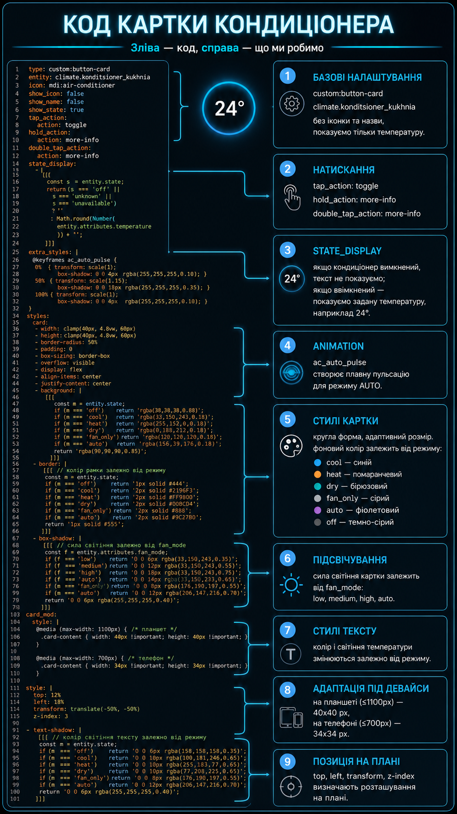
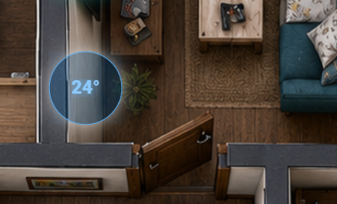
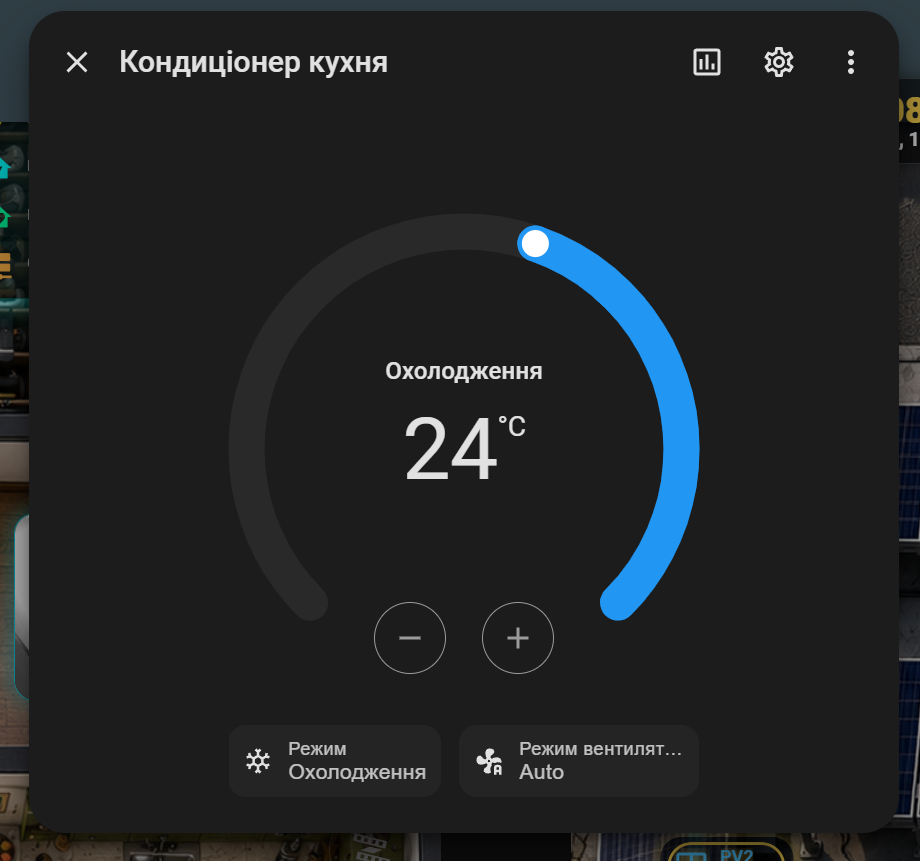

# Урок 15 — Картка кондиціонера в Home Assistant

У цьому уроці створюємо компактну круглу картку кондиціонера для 3D Dashboard у Home Assistant.

Картка показує задану температуру, змінює колір залежно від режиму роботи та адаптується під комп’ютер, планшет і телефон.

## Що ми зробимо

У цьому уроці реалізуємо:

- круглу картку кондиціонера;
- відображення заданої температури в центрі;
- увімкнення та вимкнення одним натисканням;
- відкриття стандартного керування через довге або подвійне натискання;
- різні кольори для кожного режиму;
- різну силу підсвічування залежно від швидкості вентилятора;
- пульсацію в автоматичному режимі;
- адаптацію розміру під різні пристрої;
- розміщення картки безпосередньо на 3D-плані квартири.

## Режими та кольори

- **Cool / Охолодження** — синій;
- **Heat / Обігрів** — помаранчевий;
- **Dry / Осушення** — бірюзовий;
- **Fan only / Вентиляція** — світло-сірий;
- **Auto** — фіолетовий із пульсацією;
- **Off** — темно-сірий без температури.

Сила світіння залежить від швидкості вентилятора:

- **Low** — слабке світіння;
- **Medium** — середнє;
- **High** — сильне;
- **Auto** — плавна пульсація.

## Керування

- коротке натискання — увімкнути або вимкнути кондиціонер;
- довге натискання — відкрити стандартне вікно керування;
- подвійне натискання — також відкрити повне керування.

## Файли уроку

### `air-conditioner-climate-card.yaml`

Готовий YAML-код картки кондиціонера для Home Assistant.

Перед використанням замініть сутність:

```yaml
entity: climate.konditsioner_kukhnia
```

на власну сутність кондиціонера.

### `air-conditioner-climate-card-explained.png`

Зображення з поясненням основних блоків коду.



### `air-conditioner-climate1.png`

Приклад відображення картки кондиціонера на 3D Dashboard.



### `air-conditioner-climate2.png`

Приклад стандартного вікна керування режимами, температурою та швидкістю вентилятора.



## Необхідні компоненти

Для роботи картки потрібні:

- Home Assistant;
- Lovelace;
- `custom:button-card`;
- інтегрований кондиціонер із сутністю `climate`.

`button-card` можна встановити через HACS.

## Адаптація під різні екрани

Картка автоматично змінює розмір:

- великий екран — до `60 × 60 px`;
- планшет — `40 × 40 px`;
- телефон — `34 × 34 px`.

## Відеоінструкція

Повна покрокова відеоінструкція:

[▶️ Дивитися урок 15 на YouTube](https://youtu.be/dDJip0TmadI)

## Структура папки

```text
lesson-15-air-conditioner-climate-card/
├── README.md
├── air-conditioner-climate-card.yaml
├── air-conditioner-climate-card-explained.png
├── air-conditioner-climate1.png
└── air-conditioner-climate2.png
```

## Важливо

Температура на картці береться з атрибута:

```yaml
entity.attributes.temperature
```

Це задана температура кондиціонера.

Фактична температура в кімнаті буде доступна лише тоді, коли інтеграція передає атрибут:

```yaml
current_temperature
```

## Інші уроки курсу

Усі уроки курсу зі створення 3D Dashboard у Home Assistant:

[Home Assistant 3D Dashboard Course](https://github.com/bobantonbob/home-assistant-stack/tree/main/home-assistant-3d-dashboard-course)
