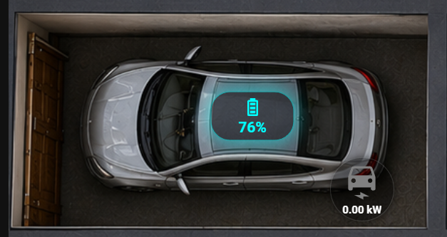

# Заняття 6 | Додаємо індикацію батареї авто на 3D Dashboard Home Assistant

У цьому занятті показуємо, як на готовий **3D Dashboard Home Assistant** додати живу індикацію для електромобіля: кнопку подачі зарядки, поточну потужність заряджання та відсоток батареї авто.

Головна ідея проста: у нас вже є великий дашборд квартири/будинку, а сьогодні ми працюємо з конкретною його частиною — **гаражем з автомобілем**.


А саме додаємо ось таку індикацію на авто:



---

## Що робимо в цьому занятті

1. Додаємо кнопку заряджання авто.
2. На цю ж кнопку виводимо поточну потужність зарядки в `kW`.
3. Додаємо окремий індикатор батареї авто у `%`.
4. Робимо красивий стиль: темний прозорий фон, бірюзову підсвітку, рамку та адаптивний розмір.
5. Розміщуємо елементи поверх картинки авто через `top` і `left`.

---

## Структура репозиторію

Файли лежать прямо в корені репозиторію:

```text
.
├── 01_charging_button.yaml
├── 02_battery_percent.yaml
├── README.md
├── car_example.png
└── dashboard_full.png
```

### `dashboard_full.png`

Це приклад повного 3D Dashboard. На ньому видно всю квартиру/будинок і всі основні елементи керування.

### `car_example.png`

Це окремий приклад тієї частини, яку ми робимо в цьому занятті: гараж, авто, заряд батареї `77%` і потужність заряджання `0.00 kW`.

### `01_charging_button.yaml`

Це YAML-код кнопки заряджання авто.

Кнопка використовує:

```yaml
entity: switch.tesla_switch
```

Потужність заряджання бере з сенсора:

```yaml
sensor.anma_charger_power_2
```

Що робить цей блок:

- натискання по кнопці вмикає або вимикає зарядку;
- на кнопці показується поточна потужність заряджання у `kW`;
- якщо сенсор потужності недоступний, показується `ON` або `OFF`;
- коли зарядка активна, кнопка світиться зеленим;
- коли зарядка вимкнена, кнопка залишається темною.

### `02_battery_percent.yaml`

Це YAML-код індикатора батареї авто.

Індикатор використовує:

```yaml
entity: sensor.anma_battery_level
```

Що робить цей блок:

- бере заряд батареї авто із сенсора;
- округлює значення до цілого числа;
- додає символ `%`;
- якщо сенсор недоступний, показує `--%`;
- виводить заряд поверх картинки автомобіля.

---

## Які сутності треба замінити під себе

У моєму прикладі використовуються такі сутності:

```yaml
switch.tesla_switch
sensor.anma_charger_power_2
sensor.anma_battery_level
```

У вас вони можуть називатися інакше. Замініть їх на свої:

```yaml
switch.your_charger_switch
sensor.your_charger_power
sensor.your_car_battery_level
```

---

## Куди вставляти цей код

Ці два YAML-файли — це окремі елементи для картки `picture-elements`.

Приклад логіки:

```yaml
cards:
  - type: picture-elements
    image: /local/dashboard/car_example.png
    elements:
      # сюди вставляємо код з 01_charging_button.yaml
      # сюди вставляємо код з 02_battery_percent.yaml
```

Тобто спочатку створюємо або відкриваємо свою картку `picture-elements`, а потім у секцію `elements:` додаємо обидва блоки.

---

## Як розмістити елементи на картинці

Позиція задається в кінці кожного YAML-блоку:

```yaml
style:
  top: 93%
  left: 29%
```

або:

```yaml
style:
  top: 89%
  left: 20%
```

`top` — це зміщення зверху.

`left` — це зміщення зліва.

Якщо елемент стоїть не там, де потрібно, міняємо саме ці два значення.

---

## Для чого тут `clamp()`

У стилях використовується `clamp()`, наприклад:

```yaml
width: clamp(52px, 7vw, 78px)
```

Це потрібно, щоб індикатори нормально виглядали на різних екранах.

Тобто елемент:

- не стане занадто маленьким на телефоні;
- не стане занадто великим на моніторі;
- буде більш адаптивним для різних розмірів дашборду.

---

## Що потрібно мати в Home Assistant

Для повторення потрібно:

- Home Assistant;
- картка `picture-elements`;
- встановлений `custom:button-card`;
- сенсор рівня батареї авто;
- сенсор потужності заряджання;
- switch або інша сутність, яка керує зарядкою.

---

## Коротко для відео

https://youtu.be/KcO1pEHh3x4

У шостому занятті ми беремо вже готовий 3D Dashboard і починаємо додавати на нього живі автомобільні дані. Спочатку робимо кнопку заряджання авто, яка не просто вмикає або вимикає заряд, а ще й показує поточну потужність у кіловатах. Потім додаємо окремий індикатор батареї автомобіля, який бере заряд із сенсора і показує його у відсотках прямо поверх картинки машини.

В результаті дашборд стає не просто красивою картинкою, а нормальним інтерактивним інтерфейсом: ми бачимо заряд авто, бачимо потужність зарядки і можемо керувати заряджанням прямо з Home Assistant.

---

## Автор

ANMAelectric / Anton Babenko
